# Why causal training beats the original PINN on chaotic PDEs — and what an RL agent can (and cannot) add

**Comparative study on PINNacle's chaotic cases: Kuramoto–Sivashinsky (KS) and Gray–Scott (GS).**
Methods: *original* = vanilla DeepXDE PINN (PINNacle defaults); *SOTA* = the causal
training recipe (Wang, Sankaran & Perdikaris, CMAME 2024): **causal loss weighting +
time-marching windows + Fourier/multi-scale input features + gated "modified MLP"**.

All numbers are from our own runs (seed 1234 main line; ~150 GPU-h across the vanilla
baseline, full causal KS 10/10 windows, full causal GS 20/20 windows, a complete
10-window no-causal ablation, 36 optimizer-chain runs, and one adaptive-controller
experiment). Every figure is regenerable from arrays archived under `runs/`; all
figures referenced here live in `analysis/report_figs/`.

---

## Part 1 — Why SOTA beats the original

### 1.1 The headline result

| | Original (vanilla) | SOTA (causal) | Factor |
|---|---|---|---|
| **KS**, full t∈[0,1] | L2RE = **1.007** | **3.56e-2** | **28×** |
| **GS**, full t∈[0,200] | L2RE = **0.094** | **1.42e-2** | **6.6×** |

The KS number matches the causal paper's reported 2.46e-2 (same order; ours is a
faithful port verified numerically against the reference code — bridged forward
agreement ~4e-7, window-0 L2 reproducible to 7 digits). The GS result is, to our
knowledge, the first causal-PINN solution of Gray–Scott.

One look at the solutions says more than the table:

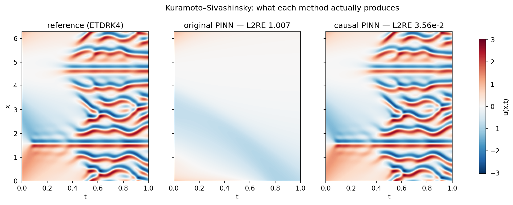
*KS space-time fields. The original PINN does not produce a solution at all — it fits
the initial-condition region and decays into a featureless wash. The causal solution is
visually indistinguishable from the reference through the fully chaotic regime.*

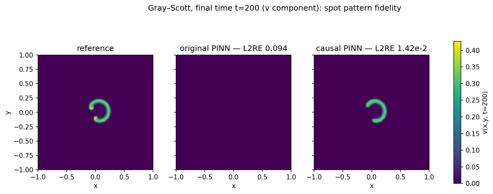
*GS at final time t=200 (v component). The entire solution content is the spot
pattern — the original PINN produces a blank background (its 0.094 L2RE is "background
right, dynamics absent"), the causal run reproduces the pattern.*

The failure is structural, not a matter of degree, and the error-growth curves prove
it: the vanilla per-time-slice error is O(1) from t≈0 onward, while the causal
solution's error starts at 6e-6 and grows along a clean exponential — the signature of
a *correct* chaotic trajectory whose error is amplified at the Lyapunov rate, not of
optimization failure.

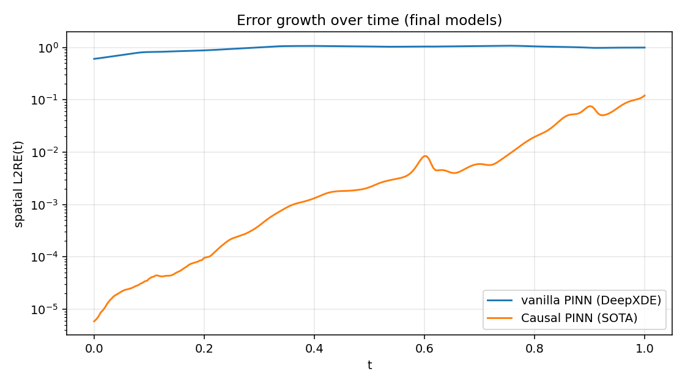

The corresponding error landscapes over the full domain (the study's core artifact):

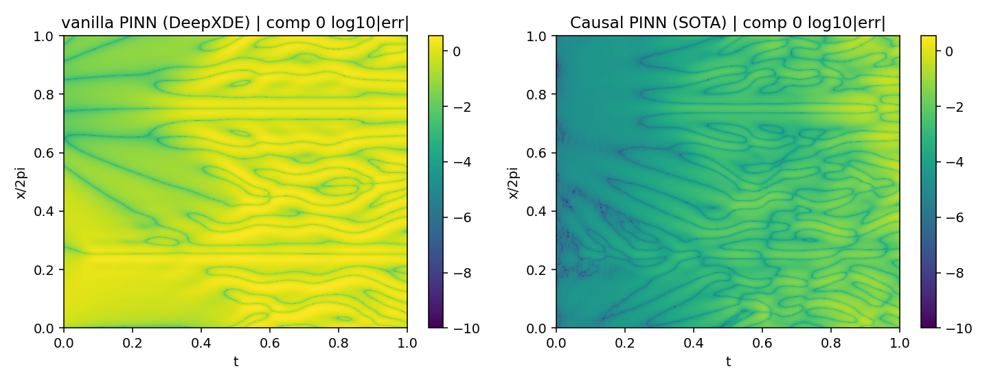
*KS: log10 |pred − ref|, shared scale. Vanilla: uniform O(1) error. Causal: 10⁻⁴…10⁻²,
structure following the physics.*

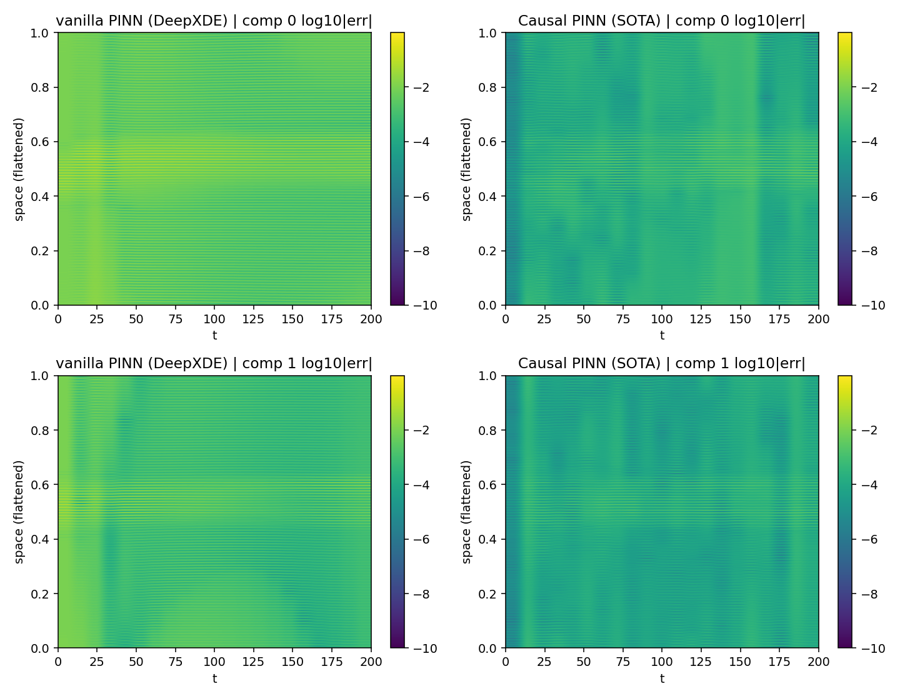
*GS equivalent (flattened space × time; u top row, v bottom row): same picture — the
vanilla error sits in bright horizontal bands at exactly the spot locations and
persists for all t (it never learns the pattern), while the causal error is ~10× lower
and unstructured.*

### 1.2 The failure mechanism: ghost minima

The decisive diagnostic is the **residual landscape**: the PDE residual of the final
vanilla model is *smooth and moderately low everywhere* — while the solution is 100%
wrong. Training minimized exactly what it was asked to minimize and converged to a
**spurious "ghost" solution**: low residual, wrong dynamics. Low residual is necessary
but nowhere near sufficient; *the order in which the residual is minimized decides
which solution you get.*

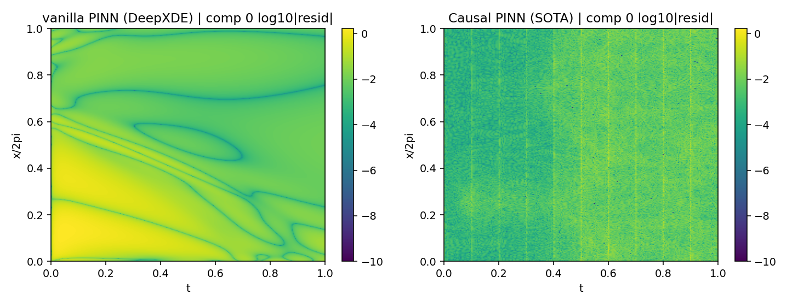
*KS residual fields: vanilla holds |R| ≈ 10⁻²…10⁰ over most of the domain despite O(1)
solution error — a self-consistent wrong solution. (GS version:
`report_figs/gs_landscape_resid.png`.)*

Quantified: across 36 independent single-shot chain runs, the training loss falls by
**2×10⁴–6.5×10⁵×** while the true error falls by **1.19×** (§2.3, Fig. 4). The
single-shot objective is not merely unhelpful — it is actively deceptive.

### 1.3 The optimization geometry: plateau vs funnel

We computed loss landscapes with the **real training trajectories** overlaid — both
trajectory-PCA planes and Li-et-al-style labeled contours:

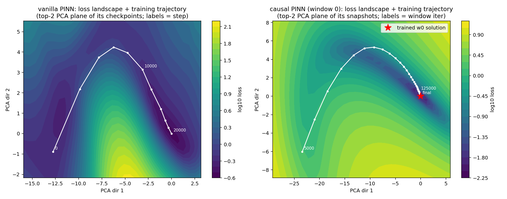
*Left — vanilla KS: the reachable landscape is a shallow plateau (log10 loss spans
−0.6…2.1 over the whole plane); the trajectory drifts over a gentle ridge and settles
in a broad dent: "converged", to the wrong attractor. Right — causal KS (window 0): the
trajectory takes huge early strides while the causally-relaxed objective is easy, then
contracts into a needle-shaped minimum (the loss falls ~7 orders of magnitude along the
way, cf. Fig. 4).*

The same two geometries in the contour rendering (trajectory in black):

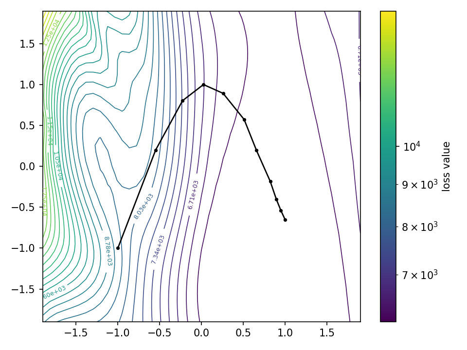
*Vanilla KS: loss 6.7e3–1.7e4 across the entire plane — a 2.5× range. There is no
funnel; no gradient path to the true solution exists from generic initialization.*

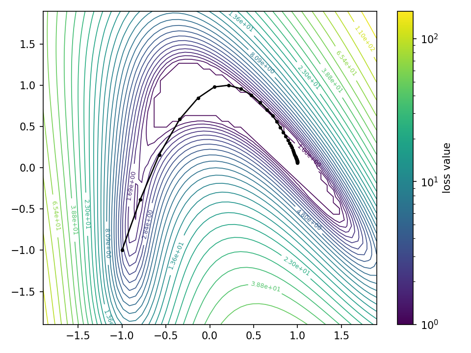
*Causal KS window 0: the true solution sits inside a needle-shaped funnel. The funnel
**exists only in the causal objective** — causal training does not search the vanilla
landscape better, it replaces it with a sequence of landscapes, each with a findable
minimum adjacent to the previous one.*

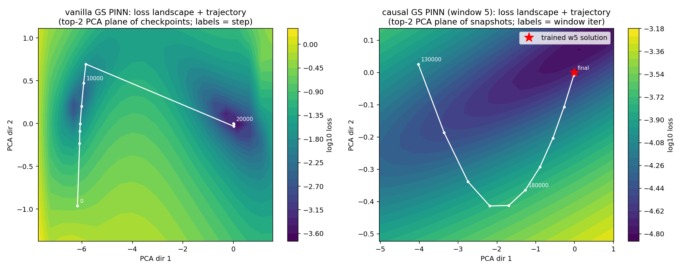
*GS: vanilla (left) again parks in a local dent far from the reference; the causal
window (right) descends into a wide, **flat, well-conditioned basin** (loss varies
&lt;10% across the trajectory plane; contour version:
`report_figs/contour_gs_causal_w5.png`) — GS is 2nd-order and benign, which §1.7 shows
predicts its training-cost profile.*

**Scope note, and the complete picture.** The panels above compare vanilla's *entire*
training run against a *single* causal window — the causal engine only began saving
intra-window snapshots partway through the campaign. With the full snapshot archive
(KS: w0 and w4–w9; GS: w1–w19; 10–73 states per window) the comparison becomes
symmetric:

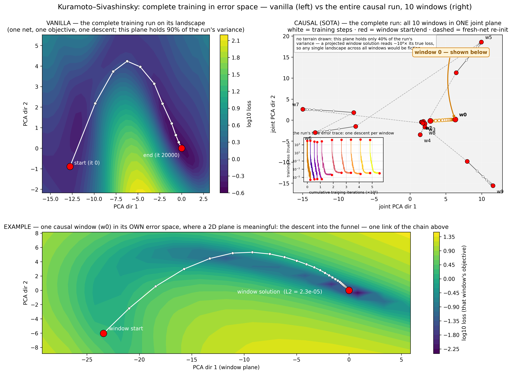
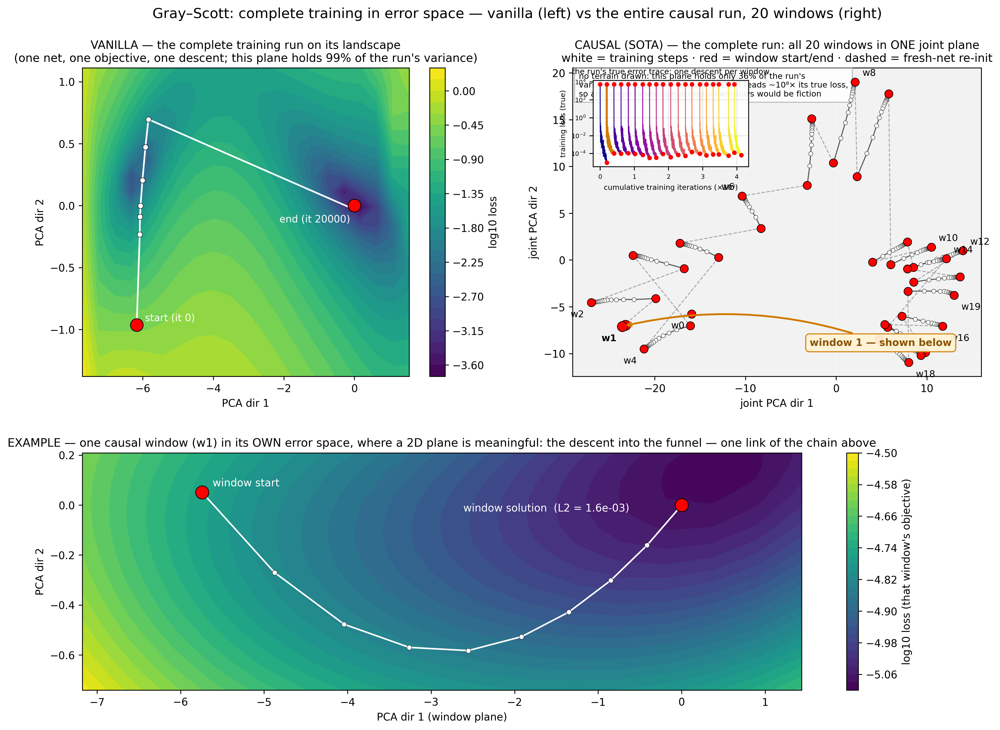
*Left: vanilla's complete run (it 0 → 20000) on its own landscape — start and end in
red, steps in white. Right: the **entire** causal run — every snapshot of all 10 (KS) /
20 (GS) windows in one joint weight-space plane; white = training steps, red = window
start/end, dashed = the fresh-net re-initialization between windows, gold = the window
shown below; the inset is the run's true error trace (one descent per window, ~8 orders
each). Bottom: that one window in its own error space, where a 2D plane is meaningful —
the descent into the funnel, one link of the chain above. High-resolution standalone
versions of the global panel: `fig29_global_causal_{ks,gs}.png`; the per-window
landscape filmstrip: `fig27_full_training_{ks,gs}.png`.*

**Why the right panel carries no terrain — a measured structural difference.** For
vanilla, a 2D trajectory-PCA plane is an honest stage: it holds **90% (KS) / 99% (GS)**
of that run's parameter variance, so the surface really is the landscape it descends.
For the causal run the same construction fails: the joint plane of all windows holds
only **40% (KS) / 36% (GS)** of the variance, and a window solution *projected into it*
evaluates at ~10⁸× its true residual (KS: 8.4e2 in-plane vs 1.8e-6 true). Drawing a
surface there would be fiction, so the panel shows the true path and puts the error
axis in the trace inset instead. This is not a plotting limitation but the fact
underneath the method: **the causal run has no single landscape by construction** —
each window trains a fresh network against its own objective (its time slice plus its
handoff IC), so "full training in error space" is a *sequence* of N landscapes chained
by re-initialization, while vanilla is one descent on one surface.

**The head-to-head picture: vanilla's whole run vs the causal run on its true global
objective**, with the example window highlighted:

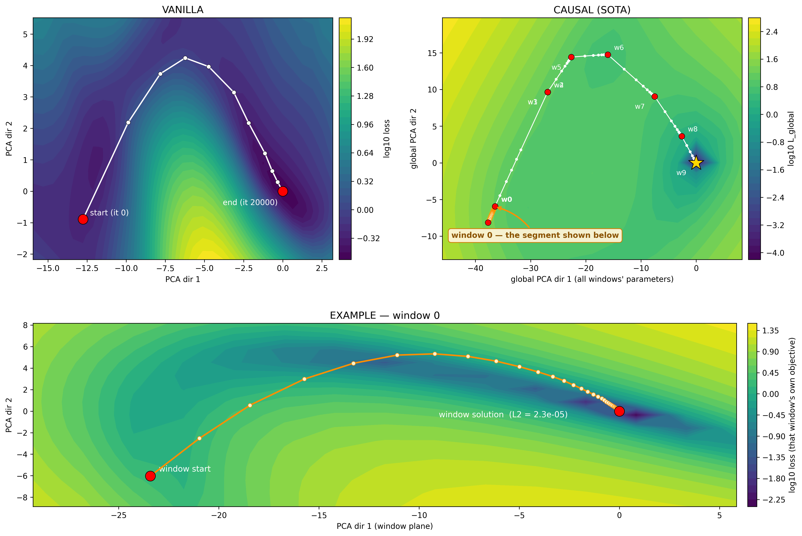
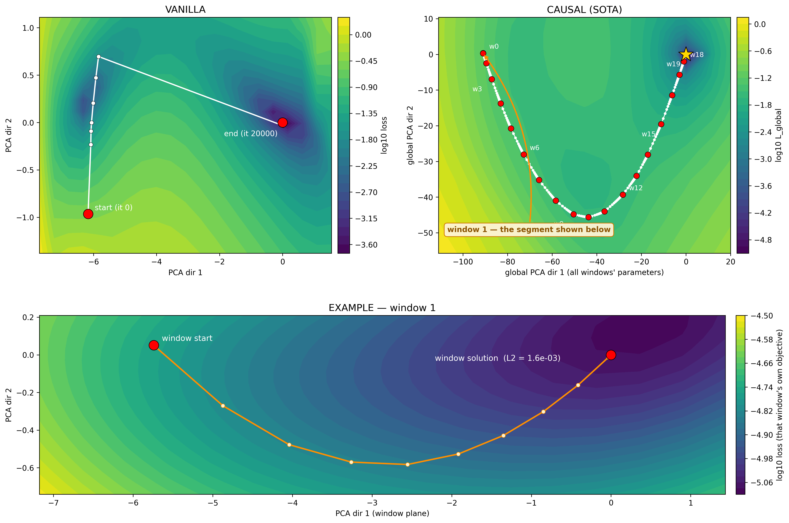
*Left: vanilla's complete trajectory on its own landscape (start/end in red) — one
descent that ends on the plateau. Right: the entire causal run drawn on the REAL global
objective defined below, gold = the segment belonging to the example window, ★ = the
full stitched solution Θ\*. Bottom: that same window alone in its own error space. The
surface on the right is exact (every point a true evaluation, exact at Θ\*); the path is
a 2D shadow — see the fidelity numbers below.*

**The run's true global error space.** The joint plane above is a map of *where* the
run goes, not of *what it minimizes* — each window has its own objective, so no single
surface spanning them is legitimate (measured: that plane holds 40%/36% of the run's
variance and a projected window solution reads ~10⁸× its true loss; the terrain drawn
on it is a mosaic of true local slices, honest but still N objectives). A genuinely
global landscape does exist, and the per-window data is exactly what it needs. The
causal method's output is the **stitched** solution, whose parameter is the *tuple* of
all window networks Θ = (θ₀ … θ_{N−1}); on that product space one objective is
well-defined:

**L_global(Θ) = ⟨PDE residual² of each window on its own slice⟩ + ‖u₀(x,0) − u_IC‖² +
⟨‖u_k(x,T_w) − u_{k+1}(x,0)‖²⟩** — physics everywhere, the initial condition, and
continuity across every interface.

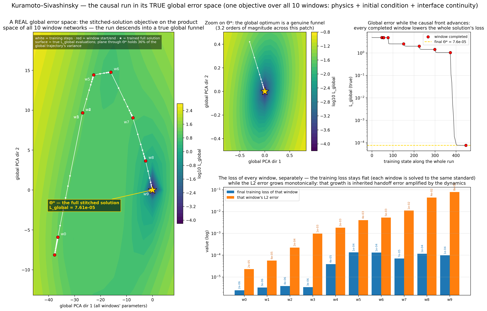
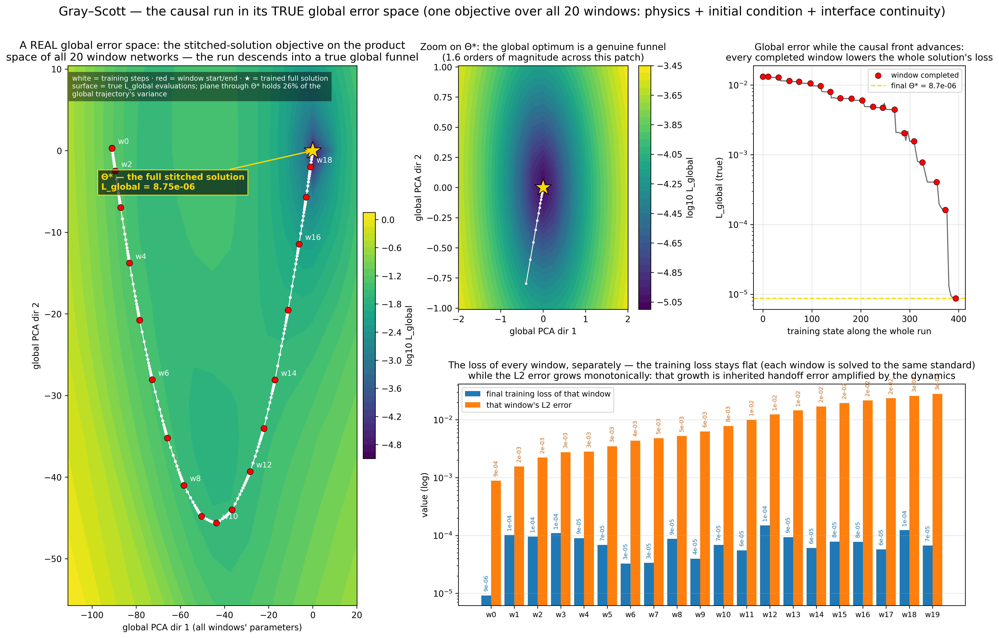
*Left: the true global landscape, plane centred on the trained full solution Θ\*, with
the whole run as one trajectory (while window k trains, only its block of coordinates
moves; white = steps, red = window edges, ★ = Θ\*). Top-middle: zoom on Θ\* — a genuine
funnel. Top-right: L_global as the causal front advances — every completed window
lowers the whole solution's loss. Bottom: the loss of every window separately.*

Three results come out of this construction, all measured:

1. **The objective is the right one**: at the trained solution the interface-continuity
   term is **3.9e-11 (KS) / 6.3e-9 (GS)** and the IC term **2.1e-11 / 9.2e-10** — the
   stitched solution is continuous and IC-consistent to numerical zero, so Θ\* really
   is the optimum of L_global, not merely near it.
2. **There is a real global funnel**: L_global = **7.6e-5 (KS) / 8.7e-6 (GS)** at Θ\*
   against **5.5e2 / 1.4** at the edge of the trajectory's own region — 5–7 orders of
   depth, with the run descending into it. The "sequence of landscapes" picture (§1.3)
   and a single global optimum are not in conflict: the curriculum is *how* this global
   funnel is reached without ever solving it globally.
3. **Per-window losses separate the two error sources** (bottom panel): every window's
   final training loss stays in the same narrow band (KS 2.5e-6…1.3e-4; GS 9e-6…1.5e-4)
   — each window is solved to the same standard — while its L2 error grows
   monotonically (KS 2.3e-5 → 7.9e-2; GS 8.8e-4 → 2.8e-2). Same optimization quality,
   growing true error: that is the inherited handoff error amplified by the dynamics,
   the mechanism §2.2 measures independently.

### 1.4 Why the combination synergizes — one principle at four scales

The ingredients are not four independent improvements that happen to stack. They are
one principle — **make optimization follow the causal and structural priors of the
PDE** — applied at four scales, wired so that each component removes a failure mode
the others leave open. The wiring is visible in the training rule itself. Inside a
window, with the residual evaluated on 32 chunks L₁…L₃₂ sorted in time:

```
W_i  = stop_grad( exp( −tol · ( Σ_{j<i} L_j  +  10⁴ · L_IC ) ) )
loss = mean_i( W_i · L_i )  +  10⁴ · L_IC          tol annealed 10⁻³ → 10²
```

Read the exponent right to left:

1. **The IC gate — where windows and causal loss couple.** Until the window's initial
   condition is fit, the 10⁴·L_IC term keeps *every* W_i ≈ 0: nothing trains but the
   IC. And the IC of window k is *the prediction of window k−1* — so the same term
   that orders training inside a window is what chains the windows into a curriculum.
   Hard marching across windows (Δt=0.1) and soft marching within them (32 weighted
   chunks) are the same time-marching idea at coarse and fine granularity, bound
   together by this gate.
2. **The cumulative-residual term** Σ_{j<i} L_j releases chunk i only after everything
   before it is resolved — fine-scale causality, observed directly as the trust front
   of §1.6.

Why both scales are needed:

- **Fine without coarse** (causal weighting over the full t∈[0,1] in one window): the
  anneal would have to sweep 10× the horizon while every late-time residual couples,
  Lyapunov-amplified, back to the earliest errors. Already *within* Δt=0.1 windows the
  sweep's cost triples as chaos deepens (§1.7) and the final-tolerance certificate
  becomes unreachable past mid-domain (§2.2) — a whole-domain sweep faces that wall
  from iteration one. Consistently, the reference recipe itself only attempts chaotic
  KS with time-marching. *(Inferred — this cell was not run.)*
- **Coarse without fine** (our measured ablation, W≡1): inside each window the
  optimizer is free to fit acausally again, and it does — a per-window penalty of
  ~1.3× at w0, ~1.8–1.9× through mid-chaos, 2.0–2.5× in the deepest windows (Fig. 2).
  The penalty *grows with chaos depth*: the two scales couple to the physics; they are
  not additive constants. Compounded through the handoffs this is the measured 2.4×
  full-domain gap.

**Where the Fourier features bind in — handoff purity.** PINNacle's KS loss contains
*no periodic-BC term at all* (IC only; verified against the source), so the vanilla
model has nothing enforcing u(0,t) = u(2π,t). The cos kx / sin kx input features make
periodicity exact **by construction** — a boundary condition moved from the loss
(soft, approximate) into the architecture (exact, free). This matters *because of* the
windows: every handoff re-anchors on the previous window's prediction, so any boundary
mismatch would enter the chain as IC error and be amplified at the Lyapunov rate
through all later windows — exactly the inherited-error mechanism §2.2 measures. With
exact periodicity that injection channel is zero, permanently. The multi-scale time
features and the gated (U/V) MLP play the analogous role for conditioning: the funnel
of §1.3 must not merely exist, it must be descendable at the anneal's pace.

**Representation must match the physics, not just be present — measured.** The GS
encoding experiment is the controlled demonstration: identical causal machinery, only
the encoding swapped — and the reference's tensor-product Fourier encoding loses 3.2×
to plain coordinates (9.6e-3 vs 3.0e-3, window 0), because GS's localized spots don't
live in global Fourier modes. Each component earns its place by matching a structure
of the problem: KS (exact periodicity, broadband chaos) → Fourier features are
load-bearing; GS (localized patterns) → they hurt.

**Why the combined effect is multiplicative rather than additive.** Each ingredient
removes a failure mode that otherwise *caps* the whole pipeline — bottleneck logic: a
chain is as accurate as its weakest link.

| configuration | causality respected | representation matched | L2RE | binding failure mode |
|---|---|---|---|---|
| vanilla | no | no | 1.007 | acausal global fit → ghost (§1.2) |
| vanilla + best of 12 optimizer chains × 3 seeds | no | no | 0.913–0.915 | same ghost — optimization effort ≠ formulation |
| windows + Fourier + modified MLP, W≡1 (ablation) | coarse only | yes | 8.61e-2 | acausal fit *within* windows |
| **full SOTA** | coarse + fine | yes | **3.56e-2** | remaining floor = inherited handoff error — physics, not optimization (§2.2) |
| full causal machinery, mismatched encoding | yes | no | 3.2× worse (GS w0 test) | representation–physics mismatch |

No subset escapes O(10⁻¹) on KS; the full set jumps two orders of magnitude. The
loss-landscape figures of §1.3 are this table made visible: the funnel exists only in
(causal objective) × (windowed horizon) × (matched representation) — delete a measured
factor (vanilla, ablation) and the plateau returns.

*(Scope note: the factorial is partial. The ablation removes causal weighting as one
unit while keeping windows+Fourier+architecture bundled; the "fine without coarse" and
"windows without Fourier" cells are mechanistic inferences and are marked as such;
every number in the table is measured.)*

### 1.5 Ingredient attribution (complete ablation, 10/10 windows)

The user-facing question — is it the causal loss, the windows, or the Fourier
features? — has a measured answer:

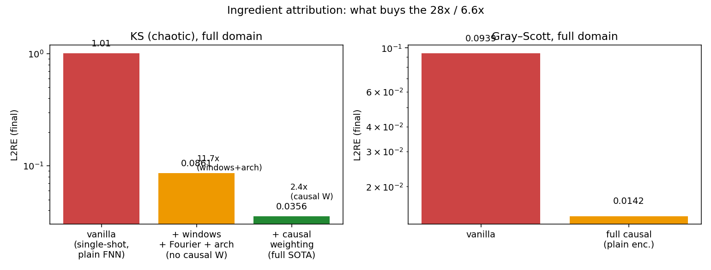

| KS configuration | full-domain L2RE |
|---|---|
| vanilla (single-shot, plain FNN) | 1.007 |
| + time windows + Fourier features + modified MLP, **W≡1** (ablation) | 8.61e-2 |
| + causal weighting (full SOTA) | **3.56e-2** |

- **Time-marching + architecture are the oxygen** (11.7× of the 28×): with Δt=0.1
  windows, hard IC anchoring, and the Fourier/gated net, even uniform-weight training
  solves chaotic KS windows. Short windows are themselves a coarse causality mechanism.
- **Causal weighting is the sharpener** (a further 2.4×): per-window it costs the
  ablation a stable ~1.8× penalty through mid-chaos that **widens to 2.0× (w8) and
  2.5× (w9) exactly where the dynamics are hardest** — and it supplies the trust
  signal W(t) that §2 turns into certificates and stall detectors.
- Encoding caveat (GS): the reference's 2D tensor-product Fourier encoding *lost* to a
  plain encoding at matched budget (9.6e-3 vs 3.0e-3 window-0 L2RE) — GS's localized
  spots don't match global Fourier modes. Fourier features are load-bearing for KS
  (exact periodicity), not universal.

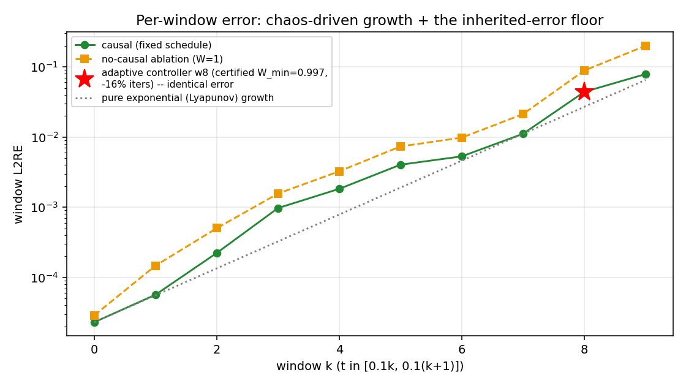
*Per-window error, causal vs ablation. Both ride the Lyapunov amplification line
(gray); causal sits uniformly below. The red star is the P1 experiment (§2.2): re-run
of w8 with an adaptive schedule — identical error, confirming the late-window floor is
inherited, not a scheduling artifact.*

### 1.6 The mechanism, observed directly

The causal weights W(t) form a **trust front** that sweeps each window from its initial
condition to its end as training progresses — six annealing cycles per window, W
collapsing each time the tolerance tightens and recovering as that stage's causality is
satisfied:

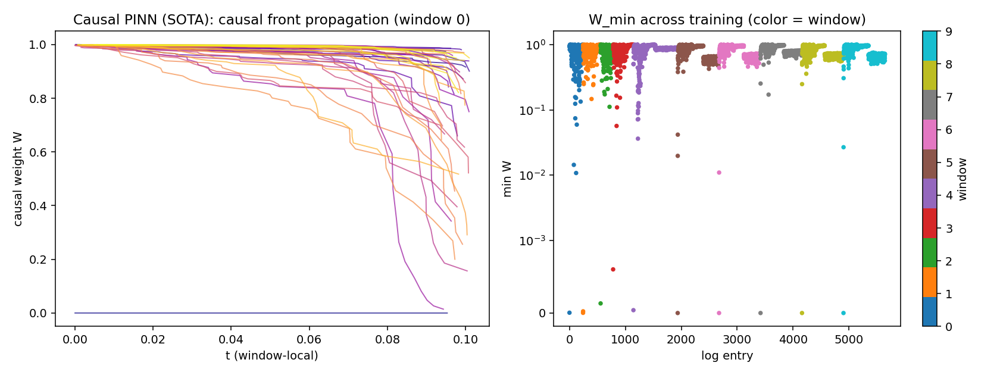
*W(t) snapshots across training (KS window 0). Combined with §1.3: the curriculum walks
the optimizer down the funnel one wall at a time — which is also why its loss signal
stays honest (§2.3) while the vanilla loss lies.*

### 1.7 Conditioning corollary: geometry predicts cost

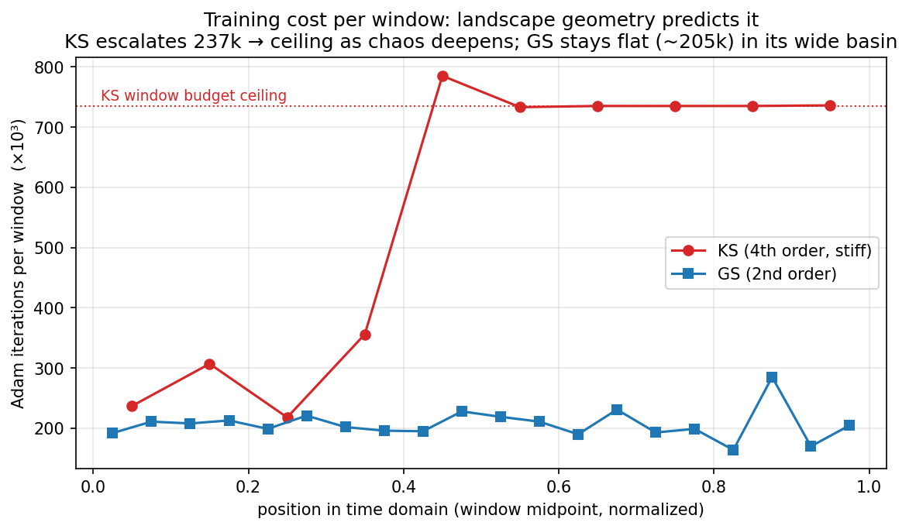

KS (4th-order, stiff, funnel-and-plateau geometry) escalates from 237k iterations in
window 0 to the ~735k budget ceiling from mid-domain on; GS (2nd-order, wide flat
basin) holds ~205k ± 30k for all 20 windows. Same recipe, same hardware, different
physics — the cost curve follows the landscape geometry of §1.3.

### 1.8 Reproducibility notes (provenance)

1. PINNacle's KS reference data is **bit-identical** to the causal authors'
   `ks_chaotic.mat`; an independent ETDRK4 integration reproduces it to ~1e-12 —
   the two formulations are the same problem.
2. The published reference's "multi-scale" time encoding is integer-power JAX
   arithmetic: negative exponents silently evaluate to 0, so trained networks actually
   see k_t = [0, 0, 0, 1, 10, 100]. Our port replicates this exactly (window-0 L2RE
   2.3042e-5 vs the JAX original's 2.302e-5).
3. Full determinism: re-running window 0 reproduces its error to 7 digits.

---

## Part 2 — How the RL agent closes the gap (and which gap it can close)

Context: the RL-PINN-OC agent (ICLR 2026) trains a DQN over autoencoder-compressed
loss-landscape states to build optimizer chains (Adam / L-BFGS / PSO + hyperparameters),
rewarded by stepwise error decrease — with a loss-based reward variant for when no
reference solution exists. On chaotic KS the published agent lands at L2RE ≈ 1.02 —
inside the failure band of Part 1. The data collected here shows exactly why, and where
the agent's real leverage is.

### 2.1 What the agent cannot do: cross the wall from inside the optimizer action space

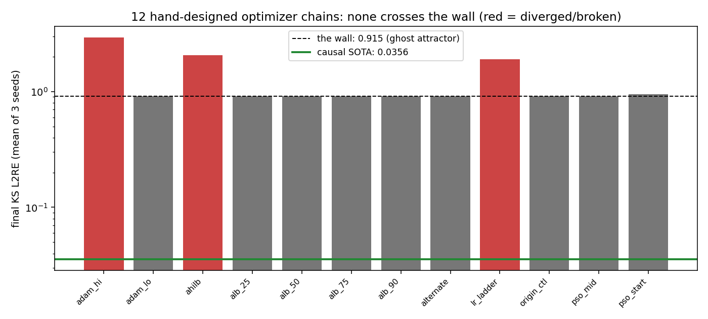

Twelve hand-designed chains (Adam→L-BFGS switches at 25/50/75/90%, PSO injections, LR
ladders, alternating segments; 3 seeds each): **every viable chain lands at KS L2RE =
0.913–0.915 with cross-seed std ≈ 0.000** — the same ghost attractor — and 4 of the 12
chains actively diverge or break. The wall is reached at 3.1–6.9k epochs, *before the
earliest switch point*, so switch timing carries zero signal on chaotic KS (H17
refuted). The landscape of §1.3 says why: every optimizer explores the same deceptive
plateau. **No policy over {optimizer, hyperparameters, switch time} can cross a 26× gap
that is formulation-bound.**

The corollary is the agent's first and largest lever:

> **L1 — adopt the curriculum.** The gap-closing action is a change of *what is
> scheduled*: the causal curriculum's controls (tolerance ladder, stage budgets, window
> advancement), not the optimizer chain. The agent's own framework already carries
> these knobs in its config (`causal_eps_schedule`, `causal_delta`,
> `num_causal_buckets`, `time_windows`) — an action-space change, not an infrastructure
> change. Formulation switch alone: 1.007 → 8.6e-2; with causal weighting → 3.56e-2.

### 2.2 What the agent adds inside the curriculum: efficiency, reliability, stall detection

We ran the agent's policy class directly (P1 experiment): an adaptive stage
controller — advance the tolerance on sustained W_min > 0.9, refuse to extend stalled
stages — replaying KS window 8 from the identical handoff state:

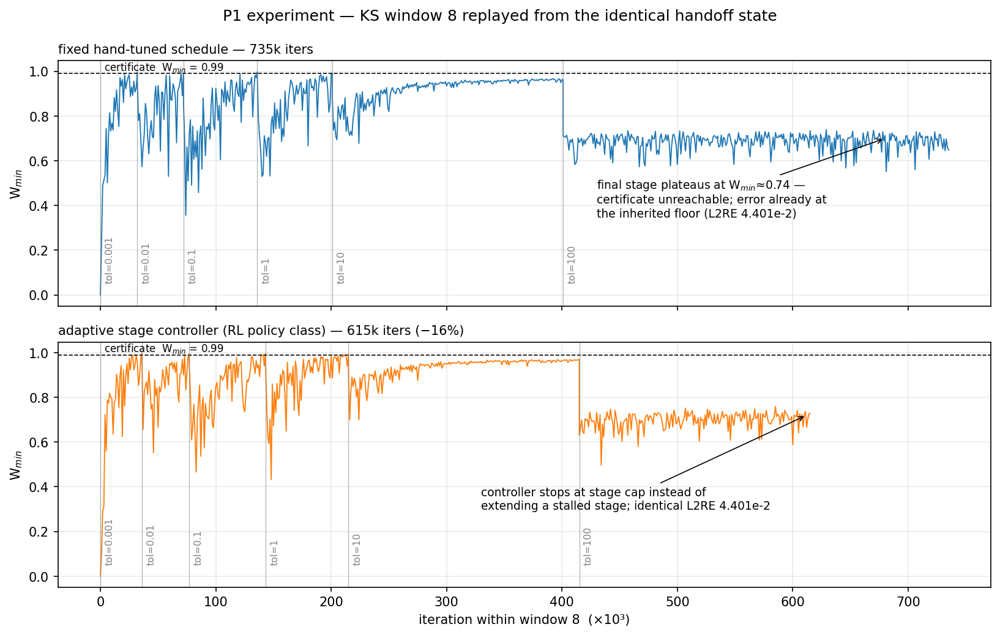

| KS window 8 | iterations | final-stage (tol=100) W_min best/end | final L2RE |
|---|---|---|---|
| fixed hand-tuned schedule | 735,000 | 0.739 / 0.648 | 4.401e-2 |
| **adaptive controller (RL policy class)** | **615,000 (−16%)** | 0.759 / 0.727 | 4.401e-2 (identical) |

Three findings in one experiment:

- **Efficiency is real**: identical error, 16% cheaper. Both runs certify every stage
  with tol ≤ 1 at W_min ≥ 0.99 and then plateau at W_min ≈ 0.74 in the final stage; the
  fixed schedule burned +134k iterations extending that stalled stage for ΔW_min ≈ 0
  and Δerror = 0, the controller stopped at the stage cap. Across a 10-window run this
  policy recycles ~10–20% of total compute; in single-shot settings wall-detection
  saves 75–90% (every post-wall iteration is waste). Add reliability: merely avoiding
  the 4/12 harmful chains of §2.1 is valuable insurance.
- **Accuracy headroom inside a window is ZERO** — the honest refutation of our own
  initial prediction. The error did not move a digit, because late-window error is
  **inherited**: accumulated w0→w7 handoff error, amplified by the chaotic dynamics,
  sets a floor the window converges to but cannot break (Fig. 2: w8/w9 sit on the
  Lyapunov line). One law covers the whole study: *on chaotic problems the accuracy
  wall is physics* — a ghost attractor in single-shot mode, inherited handoff error in
  the curriculum — *and the agent's real currencies are efficiency, reliability and
  certification.*
- **Certification has a cliff, and the cliff is informative:**

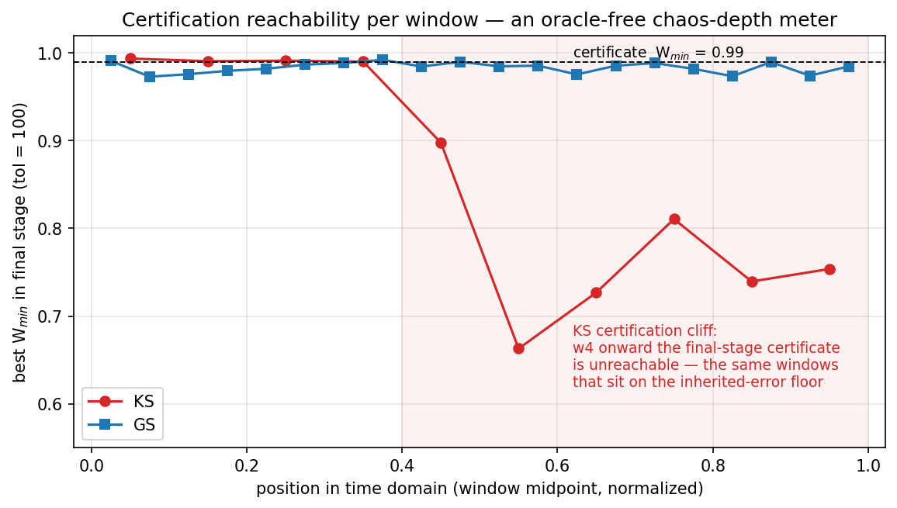

On KS the final-stage certificate (W_min ≥ 0.99 at tol=100) is reachable for windows
0–3, marginal at w4, and **unreachable from w5 on — exactly the windows sitting on the
inherited-error floor**. On GS every window reaches 0.973–0.992, consistent with its
benign geometry. So the very same observable the curriculum already computes is an
**oracle-free chaos-depth meter**: it tells the agent, without any reference solution,
whether a window is in the "certify-and-advance" regime or the "floor reached — stop
paying" regime. That is precisely the decision the P1 controller got right.

The one remaining accuracy lever the data points to is **window geometry** (shorter or
overlapping windows near late times reduce per-handoff amplification) — a Δt /
window-count action that no fixed recipe explores and that fits the agent's stage-wise
MDP naturally. Untested; the only proposed mechanism that could lower the late-window
floor itself.

### 2.3 Reward design: when the loss can be trusted (the loss-in-reward idea, made precise)

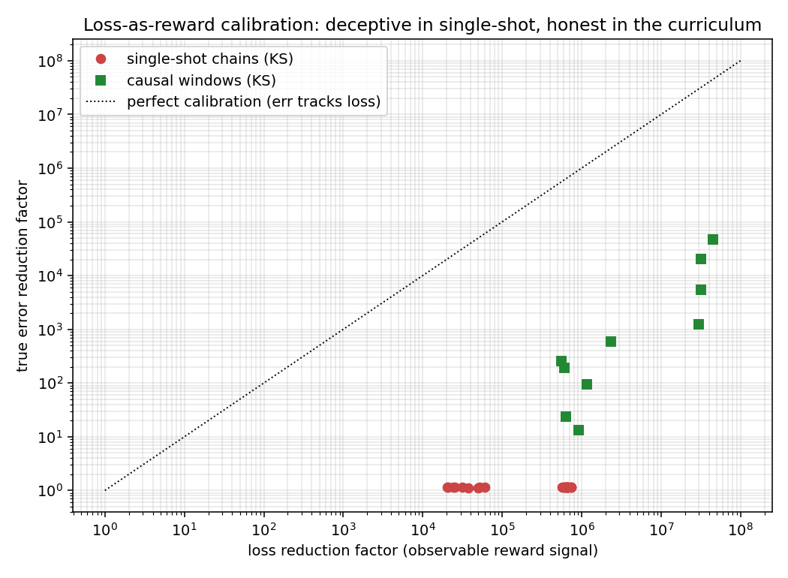

- **Single-shot (red)**: loss falls 4–6 orders of magnitude; true error falls 1.19×.
  Fine-grained corr(Δlog loss, Δlog error) = 0.06–0.14, and per-component channels
  (operator/IC) do not rescue it. A loss-based reward *pays the agent for descending
  into the ghost*; an oracle-RMSE reward is equally unlearnable there (flat at ~0.91).
- **Inside the causal curriculum (green)**: loss and error fall together (≈7 orders ↔
  ≈5 orders per window; macro-calibration ratio ≈0.6 vs ≈0.03 single-shot). The
  curriculum is not only the accuracy fix — **it is what makes the ground-truth-free
  reward truthful.**
- Practical reward for the agent:
  **r = Δlog(loss) within stages + certificate event bonus (W_min ≥ 0.99) − λ·iterations**,
  with the certificate signal used **two-sidedly** per §2.2: bonus where reachable,
  stall detection (flat W_min at final tol) as the trigger to stop spending where not.
  W_min is a sawtooth by design (it collapses at every tolerance step) — an event
  signal, not a dense one. P1 shows the policy this reward induces is exactly the
  profitable one.

### 2.4 State: the landscape representation transfers, and a free pretraining corpus exists

The agent's AE-compressed loss-landscape state is the right observable here too: the
funnel-descending and plateau-stuck regimes are separable at a glance (§1.3), which is
precisely the advance/hold distinction the agent needs. Our archives contain 150+ full
parameter snapshots across causal, ablation and vanilla runs on identical architectures
(`runs/*/trajectory/`) — a ready offline corpus to pretrain the encoder and warm-start
the replay buffer with *real* curriculum transitions instead of random initialization
episodes.

### 2.5 Concrete integration

| Component | In the agent today | Change for chaotic PDEs |
|---|---|---|
| MDP structure | stage-wise decisions | keep |
| State | AE loss-landscape | keep; pretrain on our trajectory corpus |
| Action | optimizer × hyperparams | **curriculum controls**: tolerance move, stage budget, window advance, window Δt (optimizer choice stays as a secondary action, e.g. L-BFGS polish after certification) |
| Reward | ΔRMSE (oracle) / Δloss | **Δlog-loss (valid in-curriculum) + W_min≥0.99 event − λ·iters**, with stall detection |
| Termination | error ≤ ε, K_max, divergence | window certification or certified stall; divergence guard unchanged |

Predictions status: P1 (budget reallocation improves late-window accuracy) — **refuted
by measurement**; P1′ (it buys efficiency at equal accuracy) — **confirmed, −16%
iterations**; P2 (loss-reward ≡ oracle-reward inside the curriculum) — **confirmed at
macro scale** (Fig. 4); P3 (landscape state separates regimes) — supported by §1.3;
window-geometry accuracy lever — open, one-session testable.

### 2.6 Honest limits

An RL agent — any scheduler — cannot beat the physics: single-shot chaotic PINNs end in
ghosts regardless of policy, and inside the curriculum the late-window floor is set by
accumulated handoff error, addressable (if at all) only through window geometry. What
the agent delivers is everything *around* that limit: it discovers/schedules the
formulation that closes the 26× gap, runs it 10–20% cheaper, detects stalls and
certifies convergence without a reference solution, and removes the manual tuning the
fixed recipe demands — the agent paper's thesis, now with the chaotic regime's boundary
conditions mapped.

---

## Data & figure index

**Figures (all in `analysis/report_figs/`)**

| file | content |
|---|---|
| fig0_ks_solutions / fig0_gs_solutions | reference vs original vs causal solutions |
| ks_error_growth (+ gs_error_growth) | per-time-slice L2RE, both methods |
| ks_landscape_err / gs_landscape_err | error landscapes (the core artifact) |
| ks_landscape_resid / gs_landscape_resid | residual landscapes (ghost diagnostic) |
| ks_losslandscape_trajectories / gs_losslandscape_trajectories | trajectory-PCA loss landscapes with training paths |
| contour_ks_vanilla / contour_ks_causal_w0 / contour_gs_causal_w5 | labeled-contour (paper-style) renderings |
| fig1_ingredient_decomposition, fig2_perwindow_floor | ablation attribution |
| ks_causal_front | W(t) trust front over training |
| fig5_cost_per_window | KS cost escalation vs GS flat |
| fig3_optimizer_wall | 12 chains vs the 0.915 wall |
| fig6_p1_adaptive_vs_fixed, fig7_certification_cliff | P1 experiment; certificate reachability |
| fig4_reward_calibration | loss-vs-error calibration, single-shot vs curriculum |

**Runs (local archive, ~2 GB, all arrays)**: `runs/kaggle-causal-ks-session9/` (KS
10/10), `runs/kaggle-causal-gs-session7/` (GS 20/20), `runs/kaggle-causal-ks-ablation-s5/`
(ablation 10/10), `runs/07.18-13.19.39-baseline-chaotic/` (vanilla KS+GS),
`runs/kaggle-adaptive-w8/` (P1), `runs/kaggle-ks-w0-trajectory/` (48-snapshot
trajectory), plus the 12-chain × 3-seed × {KS, GS} chain study (`runs_chains.zip`).

**Documents**: `analysis/FINDINGS.md` (full study log), `analysis/RL_AGENT_HYPOTHESIS.md`
(hypotheses H16–H19 with verdicts + P1 write-up), `analysis/DR_FIGURE_IDEAS.md`.
Figure generators: `analysis/compare_chaotic.py`, `analysis/loss_landscape*.py`,
`analysis/landscape_paper_style.py`, `analysis/make_report_figs2.py` (fig0/5/6/7;
fig1–fig4 are synthesis plots of the tables recorded in `FINDINGS.md` and
`RL_AGENT_HYPOTHESIS.md`).
