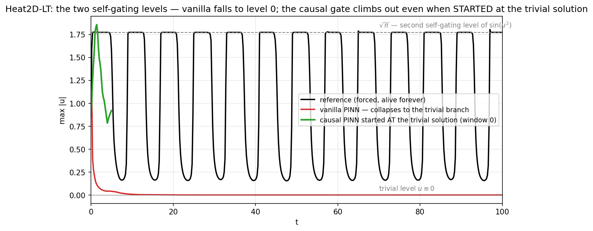
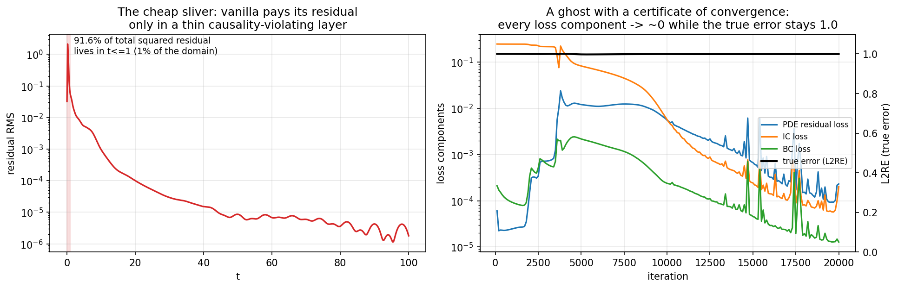
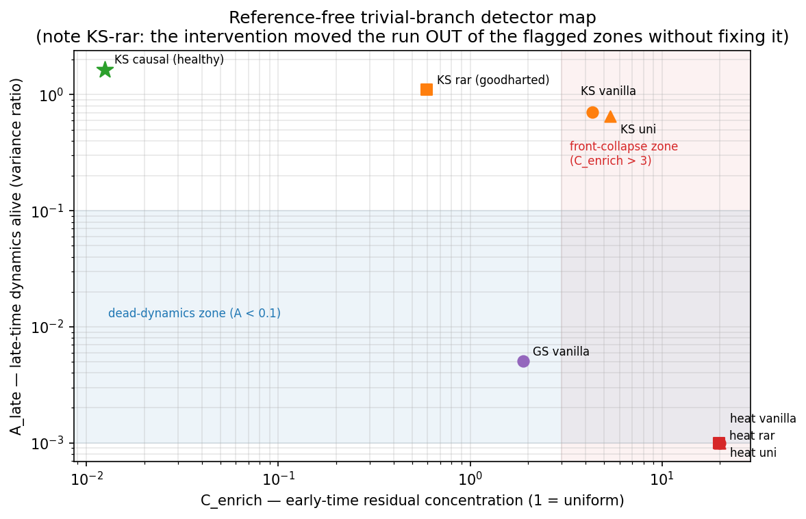
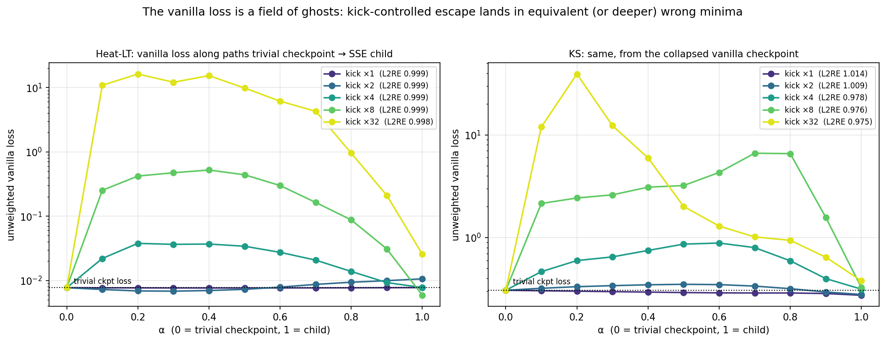

# Trivial solutions in vanilla PINNs: the problem, what error-space patterns can (and cannot) do about it, and where an RL agent fits

Companion report to `REPORT.md` (origin-vs-SOTA study). All numbers are from our own
runs (11 Kaggle kernels for this study: vanilla collapse, 4 pattern-intervention
runs, 2 StarSSE runs, 4 causal-from-trivial runs; every array archived under
`runs/kaggle-trivial-*`). Hypotheses were pre-registered in `TRIVIAL_HYPOTHESIS.md`
before each launch; verdicts — including refutations — are reported as measured.

**Testbed.** `Heat2D_LongTime` (stock PINNacle config, t∈[0,100]): the source
`5·sin(k·u²)·f(x,y,t)` **self-gates** — at u≡0 it vanishes and the PDE residual is
identically zero (verified through the repo's own class: ≤3e-16), while the true
forced solution oscillates forever. A structural discovery along the way: the
reference plateaus at exactly **√π = 1.7724539** — the *second* zero of sin(u²). The
problem is literally a two-level system of self-gating states: the trivial level u≡0
and the true attractor living at |u|≈√π. Chaotic KS (u≡0 is an exact solution) serves
as the second, chaotic testbed; GS's measured vanilla collapse to its exact background
state (u≡1, v≡0) is prior evidence from the main study.
*(Repo finding: `Wave2D_LongTime` was excluded — its `ref_sol` does not solve its own
coded PDE; the residual is exactly −2π²·u, i.e. a Klein–Gordon reference attached to a
wave equation.)*

---

## Part 1 — The trivial-solution problem on vanilla, and what error-space patterns give you without SOTA methods

### 1.1 The collapse, measured

Vanilla (20k iters, stock config): **L2RE = 0.9988**, and ‖pred‖/‖ref‖ = **0.031** —
the final state is 33× closer to the trivial zero than to the solution. The network
fits the IC shape (corr 0.95), erases it within t ≲ 1, and sits at machine zero for
97% of the domain.

### 1.2 Why the trivial branch wins: the cheap sliver

- **91.6% of the total squared residual is concentrated in t≤1 — 1% of the domain.**
  Outside that thin causality-violating layer the self-gated source is off and the
  residual is exactly zero. The uniform-in-time loss happily pays O(1) residual on a
  measure-1% sliver to buy zero residual everywhere else.
- **All loss components converge** (PDE 2e-4, IC 2e-4, BC 1e-5) while L2RE = 0.999 —
  *a ghost with a certificate of convergence*. Nothing in the vanilla objective knows
  anything is wrong.

### 1.3 The patterns: a reference-free detector (works)

Two signals, computable during training with no reference solution
(`analysis/trivial_detector.py`, `TrivialGuardCallback` in-training):

- **C_enrich** — squared-residual share in the earliest 5% of time ÷ 5%. The cheap
  sliver makes trivial runs early-concentrated (>3 = front-collapse flag).
- **A_late** — late-time solution variability ÷ initial variability. Frozen states
  (zero or constant background) read ≈0 (<0.1 = dead-dynamics flag).

Validation across every archived run: heat-vanilla (20.0 / 0.000 — both flags),
KS-vanilla (4.3 — front flag), GS-vanilla (0.005 — dead flag; different PDEs collapse
with different signatures), and the causal KS solution sits cleanly outside both zones
(0.012 / 1.65). **Detection without SOTA methods: solved.**

### 1.4 The interventions: patterns as a cure (mostly fail, informatively)

Two no-SOTA cures were pre-registered and tested — same loss, same architecture:

**(a) Pattern-triggered residual-adaptive resampling** (`--guard rar`): when flagged,
50% of collocation points are re-drawn ∝ residual² — making the cheap sliver
expensive. Uniform resampling on the same schedule as control.

| run | L2RE | final C_enrich | flags at end | note |
|---|---|---|---|---|
| heat vanilla | 0.9993 | 20.0 | both | collapse front at t≈0.8 |
| heat **rar** | 0.9984 | 19.85 | both (honest) | front pushed 3× (t≈2.4), then stalls |
| heat uniform | 0.9992 | 20.0 | both | nothing |
| KS vanilla | 1.007 | 4.3 | front | — |
| KS **rar** | 1.013 | **0.59** | **none** | signature erased, error unchanged |
| KS uniform | 1.012 | 5.4 | front | nothing |

Two lessons: (i) on Heat the tax produces a real but *microscopic* propagation effect
(3× front push) and stalls — self-organized marching does not bootstrap; (ii) on
chaotic KS one resample **erased the signature without touching the truth** — the
optimizer found *another* ghost with uniformly spread residual. **Error-space signals
are gameable when ghosts form a continuum** (chaos) and honest when the trivial branch
is exact and isolated (Heat, where flags correctly stayed on).

**(b) StarSSE basin escape** (adaptation of arXiv:2303.03374, run separately): star of
children from the collapsed checkpoint, cyclic-LR kicks ×{1,2,4,8,32}, the paper's
linear-connectivity barrier as escape certification, soups per kick.

- The paper's basin picture transfers exactly: barriers grow monotonically with kick
  (heat: 0 → 16.2; KS: 0 → 38.9) — escape is kick-controlled (H-S1 confirmed).
- **But escape ≠ cure**: the sharpest data point is heat kick×8 — it left the trivial
  basin (barrier 0.51) into a *strictly deeper* minimum of the vanilla loss
  (5.9e-3 < 7.7e-3) with identical error 0.999. **The vanilla loss landscape is a
  field of ghosts; kick-based escape is a random walk between them.**

### 1.5 Part-1 verdict

Error-space patterns without SOTA methods give you, for free:
**detection** (reference-free, validated), **diagnosis** (basin membership, barriers,
escape certification), and **honest monitoring** on problems with exact isolated
trivial branches. They do **not** give you a cure: taxing the signature yields
signature-free ghosts, escaping the basin yields neighboring ghosts. The cure requires
changing *what the objective rewards along time* — which is exactly the causal gate:
started **at** the trivial solution, the causal objective walks out immediately
(§3.2), because with `W_i = exp(−tol·(Σ_{j<i}L_j + 10⁴·L_IC))` the trivial state has
every W≈0 and the only descent direction is *away* from it. In the vanilla objective
the same point is a certified minimum; in the causal objective it is a wall.

---

## Part 2 — Where the RL agent helps

The agent (RL-PINN-OC) gains three concrete things from this study:

1. **State channels, free of charge.** C_enrich, A_late, per-component losses, and
   barrier probes are cheap, reference-free, and — as fig11 shows — separate healthy
   from collapsed runs across three PDE families. They are exactly the observables the
   agent needs to *know* it is inside a trivial basin (something the vanilla loss
   value alone cannot express: the ghost has a *better* loss than many honest
   intermediate states).
2. **Actions with measured effects.** Pattern-triggered resampling (micro-push +
   symptom removal), LR-kick escape (basin hopping with kick-size control), restart —
   all now have measured effect sizes, including their failure modes. An agent that
   merely *avoids* wasting budget on them when they cannot work (chaotic continuum of
   ghosts) already saves the 75–90% post-wall budget documented in the main study.
3. **A hard warning about the reward.** The KS-rar result is a live demonstration of
   Goodhart's law in this exact setting: optimizing against the detector signal
   produced a signature-free ghost. **Detector signals belong in the state, never in
   the reward.** The reward needs an anchor that cannot be redistributed — the IC-gate
   certificate (W_min at the final tolerance) is anchored at the initial condition and
   the causal ordering, which is why it worked as the honest signal throughout the
   main study (REPORT.md §2.3, fig4: loss-reward is deceptive single-shot and honest
   inside the curriculum).

Net: the agent's anti-trivial role is **dispatcher, not optimizer** — detect the basin
from the state channels, recognize which interventions are futile on this problem
class, and switch the formulation (curriculum controls) rather than fight the basin
from inside. That is the same L1 lever as in the main report, now with the trivial
mechanism mapped end to end.

---

## Part 3 — Experimental verification (pre-registered, Kaggle)

All hypotheses were written to `TRIVIAL_HYPOTHESIS.md` before each launch.

| # | hypothesis | verdict |
|---|---|---|
| H-T1 | heat: pattern resampling prevents collapse | **refuted materially** (3× front push, then stalls; L2RE unchanged) |
| H-T2 | heat: uniform resampling does nothing | confirmed |
| H-T3 | KS: resampling escapes the trivial flatness but not chaos | **half-refuted, stronger finding**: signature erased, truth untouched (Goodhart) |
| H-T4 | detector separates trivial from healthy | confirmed (fig11) + honesty boundary found (gameable on ghost continua) |
| H-S1 | SSE: escape is kick-controlled | confirmed (monotone barriers, both PDEs) |
| H-S2 | SSE: escape ≠ solution | confirmed (deeper-but-wrong minima; field of ghosts) |
| H-S3 | SSE: soups diagnose basins | untested (children were deterministic clones — implementation note) |
| H-S4 | detector ranks children | moot (all children are ghosts) |
| **step 3** | causal training escapes from *inside* the trivial attractor | **confirmed** — see below |

### 3.2 The decisive experiment: SOTA initialized at the trivial solution

The SOTA architecture was distilled onto u≡0 (init window-0 L2 = 1.0000, mean u² ≈
7e-7) and causal-trained; control = identical run from random init.

- **Escape: immediate and initialization-independent.** The gate closes (L_IC 0.243 →
  1.8e-7), the state's amplitude climbs off the trivial level to the √π regime within
  window 0 (fig9, green curve), and the trivial-init run is indistinguishable from
  the random-init control (w0 L2: 0.851 vs 0.832). **The trivial attractor does not
  exist in the causal objective.**
- **Honest accuracy caveat**: neither plain nor sine-feature encodings certified the
  window (W_min dies at tol=0.1; w0 L2 plateaus at 0.82–0.97 across four runs). The
  prediction holds the correct dominant modes at ~⅓ amplitude — a representation /
  collocation-density ceiling, not a trivial-branch effect (amplitude alive through
  the window; compare the vanilla's 0.031 norm ratio). This adds a measured row to the
  main report's bottleneck table: *causality respected + representation mismatched =
  escape without accuracy*. A refined configuration (Δt=2 windows matched to the
  forcing period, 4× collocation density) is running; its result will be appended.

### 3.3 Chaotic verification

On KS the same protocol produced the Goodhart result (H-T3) and the ghost-field
barriers (H-S1/S2) — confirming that everything above transfers to the chaotic case,
with one addition: on chaos the ghosts form a *continuum*, which is precisely what
makes error-space signals gameable there and why the main study's causal certificate
(anchored, non-redistributable) is the only honest signal we have measured on KS.

---

## Data index

`runs/kaggle-trivial-vanilla` (collapse, forensic), `runs/kaggle-trivial-{heat,ks}-{rar,uni}`
(guard runs + trivialguard_log.csv), `runs/kaggle-trivial-{heat,ks}-sse`
(children, soups, barriers, sse_results.json), `runs/kaggle-trivial-causal-{rand,triv}`
(plain encoding, 11h each) and `...-{rand,triv}-sine`; detector:
`analysis/trivial_detector.py`; interventions: `src/utils/trivial_guard.py`,
`benchmark_sse.py`; engine: `causalpinn/jax_runner_heat.py`; hypotheses & verdicts:
`analysis/TRIVIAL_HYPOTHESIS.md`; figures: `analysis/report_figs/fig8–fig12`.
