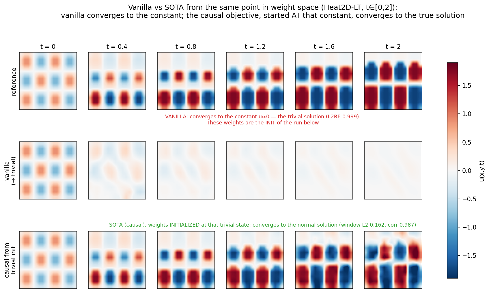
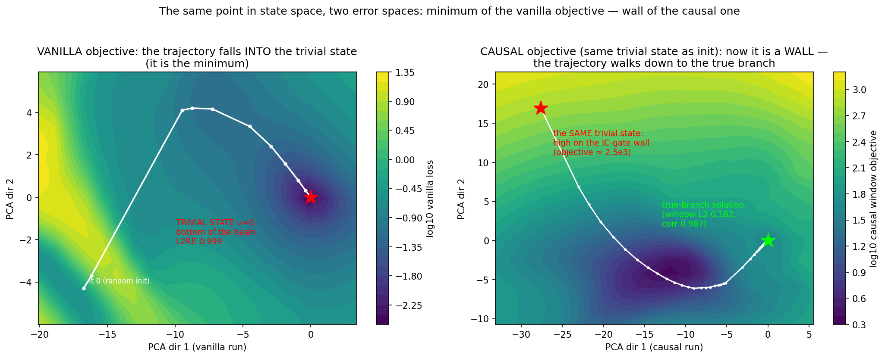
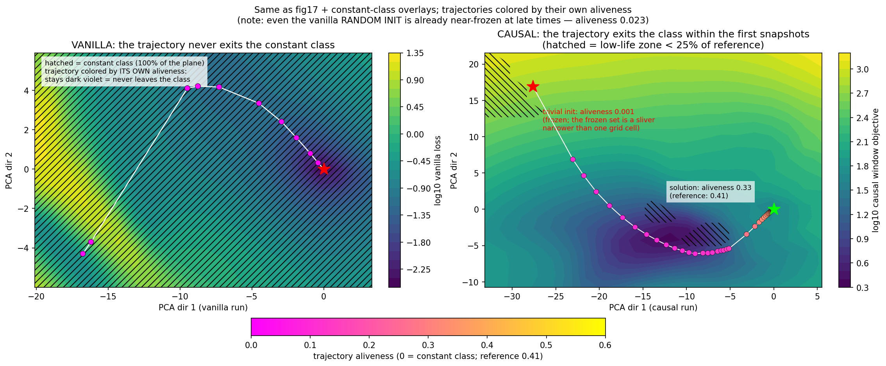
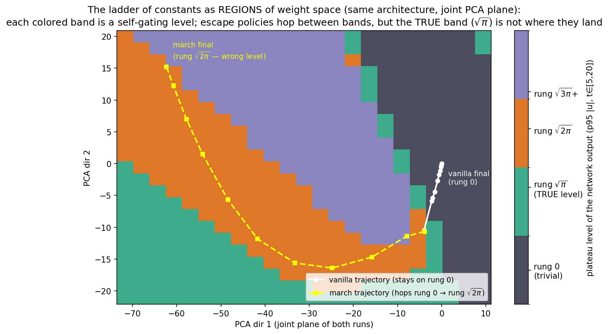
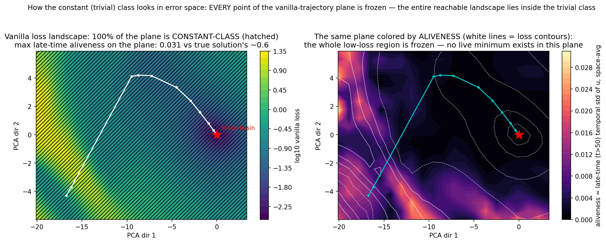
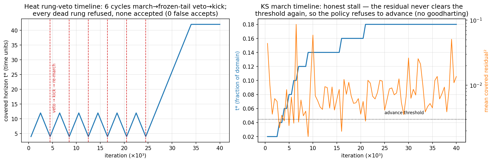
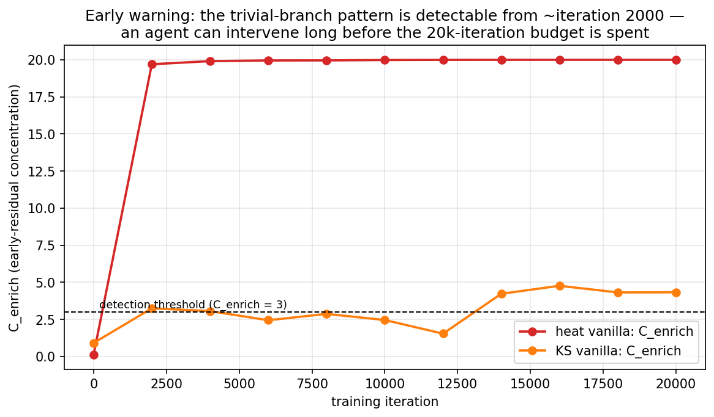
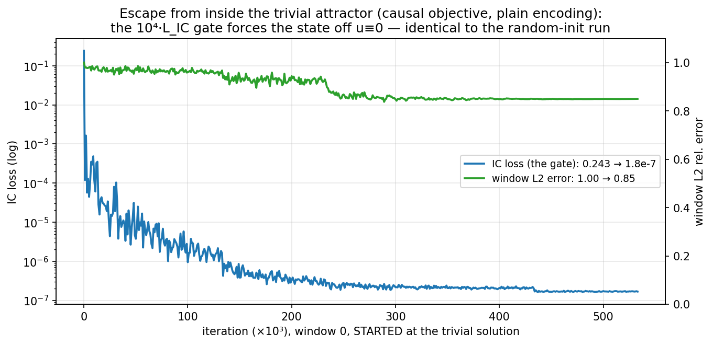
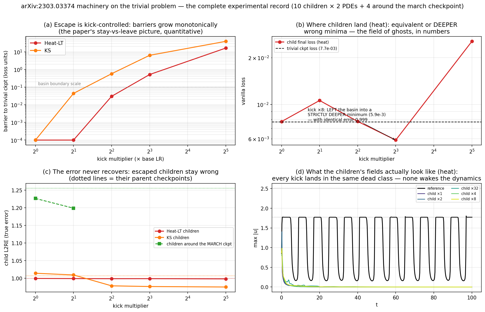

# Trivial solutions in vanilla PINNs: the error-space picture, what an RL agent can do without touching the loss, and what arXiv:2303.03374 adds

Companion to `REPORT.md`. Testbed: `Heat2D_LongTime` (stock PINNacle; the source
`5·sin(u²)·f(x,y,t)` self-gates), chaotic KS as the second case. 15 Kaggle kernels,
every hypothesis pre-registered in `TRIVIAL_HYPOTHESIS.md` before launch, every array
archived under `runs/kaggle-trivial-*`.

**The structural discovery that frames everything.** sin(u²) = 0 at
u ∈ {0, √π, √2π, √3π, …} — the PDE has a **ladder of self-gating levels**, each an
(almost) zero-residual branch. The trivial solution u≡0 is only the *bottom rung*;
the true solution lives at level √π (the reference plateaus at 1.7724539 = √π to 7
digits). This single fact explains every experimental outcome below.

*The report's summary in one picture: vanilla falls to rung 0; a pattern-driven
sampling policy (no loss change) escapes rung 0 — and lands on rung √2π; only the
causal gate, started from inside the trivial solution, climbs to the correct rung √π,
because time-ordering is the only signal that says which branch evolves from the IC.*

**The before/after pair (the study's core comparison).** Vanilla converges to the
constant (trivial u≈0) — and the SOTA run whose weights are *initialized exactly at
that collapsed state* converges to the normal solution:

*Top: reference. Middle: what vanilla converges to — the IC fades into the constant
u≈0 by t≲1 (L2RE 0.999); these exact weights (distilled) are the initialization of
the bottom row. Bottom: the causal objective, started AT the trivial state, converges
to the true solution (v3, window L2 0.162, corr 0.987; the roughness at t=2 is the
uncertified window tail). Same architecture class, same data — the only difference is
what the objective rewards along time.*

The same comparison **in error space, with the real training trajectories**:

*Left — the vanilla objective (trajectory-PCA plane of the vanilla run): the training
trajectory falls INTO the trivial state; it is the bottom of the basin. Right — the
causal window objective (PCA plane of the causal-from-trivial run, 67 snapshots): the
SAME trivial state now sits high on the IC-gate wall (objective ≈ 2.5e3, red star),
and the trajectory walks down the valley to the true-branch solution (green star,
window L2 0.162). One point in state space, two roles: minimum of one objective, wall
of the other — this is the entire mechanism in a single picture.*

With the constant-class regions overlaid and the trajectories colored by their own
aliveness (does the path avoid the frozen class or not):

*Left: 100% of the vanilla plane is constant-class (hatched) — the trajectory has
nowhere to escape to and every point of it stays dark (frozen); note that even the
RANDOM INIT is already near-frozen at late times (aliveness 0.023). Right: on the
causal plane the frozen set is a sliver around the trivial init narrower than one
grid cell — the trajectory exits the class within the first snapshots (points warm
up along the path: 0.001 → 0.33 vs reference 0.41).*

And the ladder itself as REGIONS of weight space (vanilla and march share one
architecture, so both trajectories live on one joint plane):

*Each colored band is a self-gating level (plateau amplitude of the network output).
The vanilla trajectory (white) stays inside the rung-0 band; the march trajectory
(yellow) crosses bands and settles at √2π — walking right past the green TRUE band
without entering it (its endpoint field measures 2.512 = √2π; cell colors are the
p95 level of each grid point). Escape policies hop between bands; nothing in the
vanilla objective makes the green band special.*

> **Takeaway of the opening figures (14–19).** The trivial solution is not an
> isolated accident but the bottom rung of a *ladder* of self-gating branches, and
> in the vanilla objective this whole ladder is invisible: its rungs are ordinary
> minima (fig17-left), its region fills the entire reachable subspace (fig18-left),
> and nothing marks the true branch (fig19). The causal objective re-scores the same
> state space so that the trivial state becomes a wall and the descent leads to the
> branch that evolves from the IC (fig17-right, fig15). Everything below unpacks and
> quantifies this picture.

---

## 1. The error-space picture of the collapse, with the pattern highlighted

**Left — the loss landscape** (trajectory-PCA plane of the real vanilla run, loss
evaluated on fixed points): the training trajectory (it 0 → 20000) walks off the
high-loss wall and descends into a deep, smooth basin whose bottom is the trivial
solution — PDE residual identically zero (self-gated source), loss 10^−2.4, **L2RE
0.999**. A *certified wrong minimum*: every loss component converges (PDE 2e-4, IC
2e-4, BC 1e-5) — fig10.

**Right — the pattern, highlighted**: the map of residual over (time × training
iteration). As training proceeds, all residual mass retreats into a thin layer at
t≈0 — the **causality-violating layer**. Measured: 91.6% of the total squared
residual in 1% of the domain. This is the reference-free signature of the trivial
branch:

- **C_enrich** (early-time residual concentration): 20× on collapsed heat;
- **A_late** (late dynamics alive): 0.000 on collapsed heat.

The detector map (fig11) separates every collapsed run (heat 20.0/0.000, KS 4.3
front-flag, GS 0.005 dead-flag) from healthy causal solutions (0.012/1.65) across
three PDE families — detection is solved, without SOTA methods and without a
reference solution.

**Where the constant class lives in this space.** Coloring the same plane by
*late-time aliveness* (temporal std of u for t>50 — ≈0 for any constant or frozen
pattern, ≈0.6 for the true forced solution) shows the strongest structural fact of
the study:

*Every point of the plane reachable by the vanilla trajectory is inside the constant
class: max aliveness anywhere on the plane is 0.031 vs the true solution's ≈0.6 —
100% of the plane is frozen (hatched). The vanilla optimizer is not choosing the
trivial solution among live alternatives; in the subspace its own gradients explore,
live solutions do not exist at all. Escape along these directions is impossible in
principle — consistent with every intervention result in §2.*

Supporting figures: `fig10_cheap_sliver.png` (why the trivial branch is profitable:
the uniform-in-time loss pays O(1) residual on a measure-1% sliver and gets zero
everywhere else), `fig11_detector_map.png`.

> **Takeaway of §1.** Three facts, all measured: (i) the collapse is *certified* by
> the vanilla loss itself — every component converges while the answer is wrong
> (fig10); (ii) it leaves a reference-free fingerprint — the causality-violating
> residual layer and dead late-time dynamics (fig13-right, fig11) — so detection
> requires neither SOTA methods nor the true solution; (iii) the reason no
> intervention inside the vanilla objective can fully cure it is geometric: the
> entire subspace explored by vanilla gradients lies inside the constant class
> (fig16) — there is nothing alive to converge to along those directions.

## 2. RL agent + vanilla error space, loss untouched: how far can it get?

The agent is allowed exactly two things: *read* the pattern (state) and *act* on
anything that is not the loss formula — collocation sampling, restarts, LR moves.
We tested the full action arsenal as pre-registered policy emulations:

| policy (loss untouched) | mechanism | heat outcome | KS outcome |
|---|---|---|---|
| pattern-triggered resampling ∝ residual² | make the cheap sliver expensive | front pushed 3× (t 0.8→2.4), stalls; L2RE unchanged | **signature erased, truth untouched (Goodhart)** |
| uniform resampling (control) | — | nothing | nothing |
| LR-kick basin escape (×1…×32) | jump out of the basin | escapes (barrier 16) into **equivalent or deeper wrong minima** | same (fig8 "field of ghosts") |
| **march-by-sampling** (the agent's best play) | expand collocation horizon [0, t*] only when covered residual is clean — time-marching expressed purely through the sampling distribution | **escapes the trivial state** (norm_ratio 0.76 vs 0.031, fig14 orange) — but lands on the wrong rung √2π, stalls at t*=14, and every error metric worsens (L2RE 1.26 full / 2.11 covered vs vanilla 1.00) | front advances 9× (honest stall at the KS representation wall); covered part alive |

**Answer to question 2, measured:**

- **Avoiding the trivial STATE — yes; improving the error — no.** The march policy
  demonstrably pulls the network out of the trivial attractor with zero loss changes
  (the field is alive: ‖pred‖/‖ref‖ = 0.764 vs vanilla's 0.031; amplitude sits on a
  self-gating plateau instead of zero). But every **error** metric got *worse*:
  full-domain L2RE 1.255 vs vanilla's 0.999, and even inside the covered horizon
  t≤14 the error is 2.11 — the √2π rung is, in L2, *farther from the truth than
  zero* (corr with the reference 0.19: it is a different dynamics, not a rescaled
  truth). Both detector flags also remain honestly on (the field beyond t* is dead).
  Escape without branch selection is not merely insufficient — it can be strictly
  counterproductive by error.
- **Converging to the TRUE solution — NO, and now we know why.** The vanilla loss
  cannot distinguish the rungs of the ghost ladder: every level is near-zero
  residual, so once the agent forces the state off rung 0, the optimizer is free to
  settle on *any* rung — and it picked √2π (measured to 3 digits: plateau 2.512 vs
  √2π = 2.507). Branch selection is exactly the information the vanilla objective
  does not contain. The causal gate selects the right branch not because it is a
  better optimizer but because **time-ordering is the physical selector**: the branch
  that evolves from the IC is unique, and `W_i = exp(−tol·(Σ_{j<i}L_j + 10⁴·L_IC))`
  is that selector written as weights. The plain-encoded causal run started *inside*
  rung 0 climbed directly to the √π regime (fig14 green; L_IC 0.243 → 1.8e-7,
  init-independent: 0.851 vs random-init 0.832). With window geometry matched to the
  forcing (v3: Δt=2, 4× collocation) the causal solution structurally tracks the true
  branch — corr 0.987 with the reference, w0 L2 0.162 from the trivial init — while
  every loss-untouched policy either stayed dead or landed on a wrong rung.

**Generalization to constants and frozen states (user extension).** The trivial
class is wider than u≡0: constants (GS's background), frozen patterns, every rung of
the ladder. Their unifying property is *self-gated dynamics* — and since Heat-LT's
forcing is explicitly time-dependent, life is mandatory for the true branch. Two
class-level reference-free signals follow: **F_freeze** (mean |u_t|, absolute-scaled)
and **F_drive** (spectral fraction at the known forcing frequency, read straight off
the PDE). Validation: reference 0.95/0.76, vanilla 0.015/0.043, the march's √2π rung
0.15/**0.006** — dead to the forcing, caught cleanly even where C_enrich/A_late were
ambiguous (for autonomous PDEs no drive signal exists; constants there are caught by
A_late — an honest scope limit). The **rung-veto policy** (march + frozen-tail veto →
kick → re-march, loss untouched) then gives the sharpest measured boundary of this
study: **6/6 dead branches correctly refused, zero false accepts** — unlike plain
march, the veto never certified a wrong rung, and the freeze signal cannot be
goodharted (you cannot fake being alive while being dead) — **but blind kicks never
found the live branch** in 6 retries (its weight-space measure is negligible), and
the budget expired back at rung 0. *Avoiding the trivial class via error space:
YES as rejection/certification, NO as synthesis.*

*Left — the veto sawtooth: six march→frozen-tail-veto→kick cycles, no dead rung ever
accepted. The tail after iteration ~25k is the cautionary detail: once the veto
budget was exhausted, the remaining plain march expanded "successfully" to t*≈42 —
along a DEAD branch (rung 0 has zero residual, so nothing resists expansion). Without
the veto, march reports false progress; with it, every acceptance is real. Right —
the KS march stall is honest for the same reason read in reverse: the covered
residual never clears the threshold, so the policy refuses to advance.*

> **Takeaway.** The veto signal (frozen dynamics) is the only component in the
> no-SOTA toolkit that cannot be gamed: 6/6 dead branches refused, 0 false accepts —
> and the moment the veto budget ran out, plain march happily reported 3× "progress"
> along a dead branch. Any agent operating in the vanilla objective should treat
> frozen-dynamics rejection as a hard constraint, not a soft reward term.

How early can the agent act? The pattern forms long before the budget is spent:

*On heat the C_enrich signature saturates (20×) by iteration ~2000 — 10% of the
budget; on chaotic KS the signal crosses the threshold reliably only late (~14k) —
early warning is problem-dependent, strongest exactly where the trivial branch is
exact and isolated.*

> **Takeaway.** On problems like Heat-LT the agent has ~90% of the budget still in
> hand when the diagnosis is already certain — the economic case for a
> detect-and-dispatch agent is strongest exactly where the detector is most honest.

And the causal escape mechanism, both configurations side by side:

*The 10⁴·L_IC gate closes within the first thousands of iterations in both configs
(started AT the trivial state); with matched window geometry (right) the window error
then collapses 0.8 → 0.162 at the moment the causal front consolidates (~110k) —
branch selection happening live.*

> **Takeaway.** The escape mechanism is robust (gate closes in every config, from
> every init), and the remaining accuracy gap is an optimization-cost issue
> (certification of later stages), not a mechanism issue: when the front
> consolidates, the error drops to the true branch by itself.

So the honest division of labor: the RL agent over the vanilla error space is a
**detector, dispatcher and escape artist** — it can refuse to waste budget (wall
detection saves the 75–90% post-collapse budget), certify basin membership, and break
out of rung 0 by sampling alone; but rung *selection* requires the causal machinery
(or any equivalent time-ordered objective) in its action space. One more hard-won
rule: **pattern signals belong in the state, never in the reward** — on KS the
resampling intervention optimized the signature away while the truth stood still
(Goodhart, measured).

> **Verdict of §2.** Loss untouched, the pattern-driven agent achieves: reliable
> detection (early on honest problems), certified rejection of the whole trivial
> class, escape from any given trivial state, and large budget savings. It cannot
> achieve: selecting or synthesizing the true branch — every escape lands on an
> arbitrary rung because the vanilla error space contains no branch information.
> The minimal sufficient addition is the causal gate in the action space; everything
> else the agent already has.

## 3. What arXiv:2303.03374 (pre-train basins, SSE/StarSSE) adds

**The complete experimental record** (10 children × {Heat-LT, KS} from the collapsed
vanilla checkpoints + 4 children around the march checkpoint; per child: one cosine
cycle, the paper's linear-connectivity barrier, loss, oracle error, weight distance):

**Heat-LT SSE** (trivial ckpt: loss 7.72e-03, L2RE 0.9993)

| kick | barrier | child loss | child L2RE | norm ratio | weight dist |
|---|---|---|---|---|---|
| 1 | 0.00e+00 | 7.74e-03 | 0.9994 | 0.027 | 0.023 |
| 2 | 0.00e+00 | 1.06e-02 | 0.9990 | 0.030 | 0.095 |
| 4 | 3.00e-02 | 7.76e-03 | 0.9986 | 0.029 | 0.229 |
| 8 | 5.14e-01 | 5.88e-03 | 0.9987 | 0.029 | 0.477 |
| 32 | 1.62e+01 | 2.55e-02 | 0.9981 | 0.028 | 1.554 |

**KS SSE** (trivial ckpt: loss 3.06e-01, L2RE 1.0068)

| kick | barrier | child loss | child L2RE | norm ratio | weight dist |
|---|---|---|---|---|---|
| 1 | 0.00e+00 | 2.74e-01 | 1.0141 | 0.382 | 0.061 |
| 2 | 4.39e-02 | 2.79e-01 | 1.0093 | 0.373 | 0.142 |
| 4 | 5.70e-01 | 3.14e-01 | 0.9784 | 0.265 | 0.291 |
| 8 | 6.31e+00 | 3.24e-01 | 0.9765 | 0.261 | 0.436 |
| 32 | 3.89e+01 | 3.78e-01 | 0.9751 | 0.219 | 1.482 |

**SSE around the march checkpoint (heat)** (trivial ckpt: loss 7.83e-01, L2RE 1.2552)

| kick | barrier | child loss | child L2RE | norm ratio | weight dist |
|---|---|---|---|---|---|
| 1 | 8.71e-02 | 3.45e-01 | 1.2264 | 0.715 | 0.108 |
| 2 | 2.88e-03 | 4.99e-01 | 1.1988 | 0.667 | 0.141 |

*(Implementation note: children within a kick are exact clones — deterministic
full-batch training — so one row per kick is shown; soups coincide with children.)*

The paper's machinery transfers to PINN weight space *quantitatively*:

- **Kick-controlled escape** (H-S1 confirmed): barriers to the trivial checkpoint
  grow monotonically with the cyclic-LR kick (heat 0 → 16.2; KS 0 → 38.9) — the
  paper's stay-vs-leave picture works as advertised, and the linear-connectivity
  barrier is a working, reference-free **escape certificate**.
- **But the vanilla landscape is a field of ghosts** (fig8): children that left the
  trivial basin landed in *equivalent or deeper wrong minima* — heat kick ×8 found a
  strictly better minimum of the vanilla loss (5.9e-3 < 7.7e-3) with identical error
  0.999. Escape without a direction is a random walk between rungs and their basins.
- **The paper used as intended — ensembling around a good pre-train**: we chained
  StarSSE (kicks ×1, ×2 — the paper's "stay in the basin" regime) around the *march*
  checkpoint (the best no-SOTA state available). Result: children stay nearby
  (barriers 3e-3–9e-2) and improve mildly (L2RE 1.255 → 1.199) — local polish inside
  the wrong rung's basin, no bridge to the √π branch. Soups degenerate (children are
  deterministic clones — full-batch training; noted honestly).
- **With or without an RL agent the conclusion is the same**: the paper contributes
  *diagnostics* (barriers = basin certificates; kick size = a calibrated escape
  action for the agent's arsenal) and *local ensembling* — not branch selection.
  An agent using SSE actions + our detector state gets exactly: certified escapes
  from rung 0 and certified basin membership — and still needs the causal selector
  to name the right rung.

### Verdict on arXiv:2303.03374

**What transfers (confirmed quantitatively):** the paper's basin picture holds in
PINN weight space exactly as advertised — escape is kick-controlled with monotone
barriers (heat 0 → 16.2, KS 0 → 38.9 across kicks ×1…×32), the linear-connectivity
barrier works as a *reference-free escape/basin certificate*, and the stay-in-basin
ensembling regime (kicks ×1–×2) delivers its promised mild local polish
(march checkpoint: L2RE 1.255 → 1.199).

**What does not transfer to the trivial-solution problem:** escape ≠ repair. The
paper's own warning — leaving the pre-train basin degrades quality — reappears here
in mirrored form: leaving the *trivial* basin does not improve quality either,
because **basin-hopping conserves ghost-ness**. Neighboring basins of the vanilla
loss are equally wrong (heat kick ×8 landed in a strictly deeper minimum, 5.9e-3 <
7.7e-3, with identical error 0.999; no child on either PDE recovered any accuracy;
no kick woke the dynamics — fig23d). Quality is a property of the *branch*, not of
the basin, and the vanilla objective the kicks explore carries no branch information.

**Bottom line:** use the paper as the *navigation instrumentation* of the
anti-trivial toolkit — calibrated escape actions, basin certificates, and local
ensembling around an already-correct state — while the *destination* (the branch
that evolves from the IC) must be supplied by causal ordering. On its own, SSE/
StarSSE machinery cannot prevent convergence to the trivial class or cure it; paired
with a causal selector it becomes genuinely useful (certify the escape, polish and
ensemble inside the true branch's basin).

## 4. Verdict table (all pre-registered)

| # | claim | verdict |
|---|---|---|
| collapse | vanilla → trivial branch, certified minimum | confirmed (L2RE 0.9988, ‖pred‖/‖ref‖ 0.031) |
| detection | reference-free pattern flags collapse | confirmed on heat/KS/GS + causal negative control |
| honesty boundary | signals gameable when ghosts form a continuum | measured (KS-rar Goodhart); honest when the branch is exact & isolated (heat flags never lied) |
| H-T1/T2 | resampling cures / uniform doesn't | refuted materially / confirmed |
| H-S1/S2 | kick-controlled escape / escape ≠ cure | confirmed / confirmed |
| rung-veto | frozen-dynamics veto rejects the whole trivial class (0, constants, rungs) | **confirmed as rejection** (6/6 refused, 0 false accepts; un-gameable signal) — synthesis of the live branch by blind kicks: refuted |
| march | sampling-only policy escapes the trivial state | **confirmed for the state** (norm 0.76 vs 0.031) — but ALL error metrics worsen (L2RE 1.26 vs 1.00; covered-region 2.11) |
| march→truth | …and reaches the true solution | **refuted with mechanism**: lands on rung √2π — vanilla loss cannot select branches |
| causal escape | causal gate exits from *inside* rung 0, init-independent | confirmed (0.851 ≡ 0.832; correct rung √π) |
| causal accuracy on heat | windows certify | improving, not yet certified: Δt=5 plateaued at w0 L2 0.82–0.97; **v3 (Δt=2 windows, 4× collocation): w0 L2 0.162, corr 0.987 — structurally on the true √π branch** (contrast march corr 0.19 on the wrong rung); window tail drifts up-ladder exactly where W_min is uncertified; init-independent for the third time (trivial 0.162 vs random 0.241); remaining limit = certification cost (227k iters/window), not mechanism |

## 5. Overall conclusions

1. **The trivial solution is a certified minimum of the vanilla objective** — all
   loss components converge while L2RE = 0.999 (fig10); on Heat-LT it is the bottom
   rung of a whole ladder of self-gating branches at u ∈ {0, √π, √2π, …} (fig14),
   and the true solution is just a different rung of the same ladder.
2. **The collapse has a reference-free fingerprint** — residual concentrated in a
   thin early-time layer (91.6% in 1% of the domain) plus dead late-time dynamics —
   validated across three PDE families with causal solutions as clean negative
   controls (fig11, fig13).
3. **In the subspace vanilla gradients explore, live solutions do not exist**: 100%
   of the trajectory-PCA plane is constant-class (fig16, fig18-left). The optimizer
   does not choose the ghost among alternatives; it never sees an alternative.
4. **Pattern-driven policies without loss changes**: detection and rejection work
   (rung-veto: 6/6 refusals, un-gameable signal, fig20); escape works (march leaves
   the trivial state, fig14); but branch selection fails — escape lands on wrong
   rungs and can worsen every error metric (march: L2RE 1.26 vs 1.00). On chaotic
   problems the softer signals are additionally gameable (KS Goodhart, fig11).
5. **arXiv:2303.03374 transfers as instrumentation, not as cure**: kick-controlled
   escape with monotone barriers and basin certificates — but basin-hopping
   conserves ghost-ness (a deeper wrong minimum with identical error, fig23).
6. **Only the causal objective selects the true branch** — because time-ordering
   from the IC is exactly the branch information the vanilla loss lacks. Started
   *inside* the trivial state it exits immediately, init-independently, and with
   matched window geometry converges onto the true branch (corr 0.987, fig12,
   fig15, fig17).
7. **Division of labor for the RL agent**: detector signals → state; frozen-dynamics
   veto → hard termination constraint; kicks/resampling/march → calibrated actions;
   causal curriculum controls → the one action that changes the outcome; reward →
   anchored certificates only (never the pattern signals themselves).

## Data & figures

Runs: `runs/kaggle-trivial-{vanilla, heat-rar, heat-uni, ks-rar, ks-uni, heat-sse,
ks-sse, heat-march, ks-march, causal-rand, causal-triv, causal-rand-sine,
causal-triv-sine}` (+ v3 pair pending). Tools: `analysis/trivial_detector.py`,
`src/utils/trivial_guard.py` (rar/uniform/march), `benchmark_sse.py`,
`causalpinn/jax_runner_heat.py`. Figures: fig8 (ghost field), fig9 (two levels),
fig10 (cheap sliver), fig11 (detector map), fig12 (gate escape, plain vs v3), **fig13
(landscape + pattern)**, **fig14 (ghost ladder — the summary figure)**, fig15
(before/after fields), fig16 (constant-class region: 100% of the vanilla plane),
fig17 (two objectives + trajectories), fig18 (fig17 + frozen overlays, trajectories
colored by aliveness), fig19 (the ladder as weight-space regions), fig20 (policy
timelines: veto sawtooth / honest stall), fig22 (early warning). Hypotheses & verdict log:
`analysis/TRIVIAL_HYPOTHESIS.md`.
