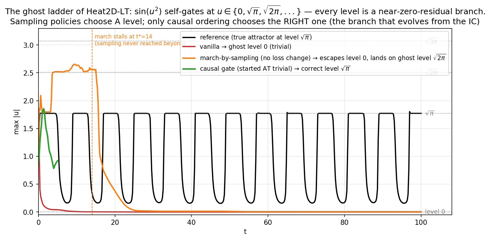
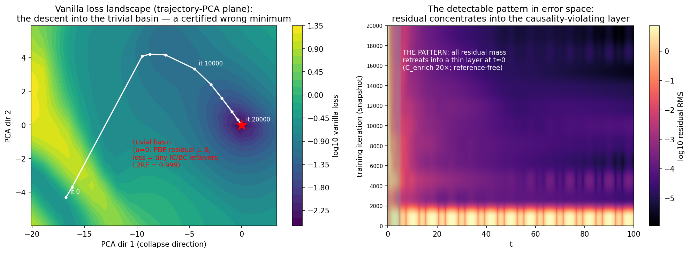

# Trivial solutions in vanilla PINNs: the error-space picture, what an RL agent can do without touching the loss, and what arXiv:2303.03374 adds

Companion to `REPORT.md`. Testbed: `Heat2D_LongTime` (stock PINNacle; the source
`5·sin(u²)·f(x,y,t)` self-gates), chaotic KS as the second case. 15 Kaggle kernels,
every hypothesis pre-registered in `TRIVIAL_HYPOTHESIS.md` before launch, every array
archived under `runs/kaggle-trivial-*`.

**The structural discovery that frames everything.** sin(u²) = 0 at
u ∈ {0, √π, √2π, √3π, …} — the PDE has a **ladder of self-gating levels**, each an
(almost) zero-residual branch. The trivial solution u≡0 is only the *bottom rung*;
the true solution lives at level √π (the reference plateaus at 1.7724539 = √π to 7
digits). This single fact explains every experimental outcome below.

*The report's summary in one picture: vanilla falls to rung 0; a pattern-driven
sampling policy (no loss change) escapes rung 0 — and lands on rung √2π; only the
causal gate, started from inside the trivial solution, climbs to the correct rung √π,
because time-ordering is the only signal that says which branch evolves from the IC.*

---

## 1. The error-space picture of the collapse, with the pattern highlighted

**Left — the loss landscape** (trajectory-PCA plane of the real vanilla run, loss
evaluated on fixed points): the training trajectory (it 0 → 20000) walks off the
high-loss wall and descends into a deep, smooth basin whose bottom is the trivial
solution — PDE residual identically zero (self-gated source), loss 10^−2.4, **L2RE
0.999**. A *certified wrong minimum*: every loss component converges (PDE 2e-4, IC
2e-4, BC 1e-5) — fig10.

**Right — the pattern, highlighted**: the map of residual over (time × training
iteration). As training proceeds, all residual mass retreats into a thin layer at
t≈0 — the **causality-violating layer**. Measured: 91.6% of the total squared
residual in 1% of the domain. This is the reference-free signature of the trivial
branch:

- **C_enrich** (early-time residual concentration): 20× on collapsed heat;
- **A_late** (late dynamics alive): 0.000 on collapsed heat.

The detector map (fig11) separates every collapsed run (heat 20.0/0.000, KS 4.3
front-flag, GS 0.005 dead-flag) from healthy causal solutions (0.012/1.65) across
three PDE families — detection is solved, without SOTA methods and without a
reference solution.

Supporting figures: `fig10_cheap_sliver.png` (why the trivial branch is profitable:
the uniform-in-time loss pays O(1) residual on a measure-1% sliver and gets zero
everywhere else), `fig11_detector_map.png`.

## 2. RL agent + vanilla error space, loss untouched: how far can it get?

The agent is allowed exactly two things: *read* the pattern (state) and *act* on
anything that is not the loss formula — collocation sampling, restarts, LR moves.
We tested the full action arsenal as pre-registered policy emulations:

| policy (loss untouched) | mechanism | heat outcome | KS outcome |
|---|---|---|---|
| pattern-triggered resampling ∝ residual² | make the cheap sliver expensive | front pushed 3× (t 0.8→2.4), stalls; L2RE unchanged | **signature erased, truth untouched (Goodhart)** |
| uniform resampling (control) | — | nothing | nothing |
| LR-kick basin escape (×1…×32) | jump out of the basin | escapes (barrier 16) into **equivalent or deeper wrong minima** | same (fig8 "field of ghosts") |
| **march-by-sampling** (the agent's best play) | expand collocation horizon [0, t*] only when covered residual is clean — time-marching expressed purely through the sampling distribution | **escapes the trivial state** (norm_ratio 0.76 vs 0.031, fig14 orange) — but lands on the wrong rung √2π, stalls at t*=14, and every error metric worsens (L2RE 1.26 full / 2.11 covered vs vanilla 1.00) | front advances 9× (honest stall at the KS representation wall); covered part alive |

**Answer to question 2, measured:**

- **Avoiding the trivial STATE — yes; improving the error — no.** The march policy
  demonstrably pulls the network out of the trivial attractor with zero loss changes
  (the field is alive: ‖pred‖/‖ref‖ = 0.764 vs vanilla's 0.031; amplitude sits on a
  self-gating plateau instead of zero). But every **error** metric got *worse*:
  full-domain L2RE 1.255 vs vanilla's 0.999, and even inside the covered horizon
  t≤14 the error is 2.11 — the √2π rung is, in L2, *farther from the truth than
  zero* (corr with the reference 0.19: it is a different dynamics, not a rescaled
  truth). Both detector flags also remain honestly on (the field beyond t* is dead).
  Escape without branch selection is not merely insufficient — it can be strictly
  counterproductive by error.
- **Converging to the TRUE solution — NO, and now we know why.** The vanilla loss
  cannot distinguish the rungs of the ghost ladder: every level is near-zero
  residual, so once the agent forces the state off rung 0, the optimizer is free to
  settle on *any* rung — and it picked √2π (measured to 3 digits: plateau 2.512 vs
  √2π = 2.507). Branch selection is exactly the information the vanilla objective
  does not contain. The causal gate selects the right branch not because it is a
  better optimizer but because **time-ordering is the physical selector**: the branch
  that evolves from the IC is unique, and `W_i = exp(−tol·(Σ_{j<i}L_j + 10⁴·L_IC))`
  is that selector written as weights. The plain-encoded causal run started *inside*
  rung 0 climbed directly to the √π regime (fig14 green; L_IC 0.243 → 1.8e-7,
  init-independent: 0.851 vs random-init 0.832).

So the honest division of labor: the RL agent over the vanilla error space is a
**detector, dispatcher and escape artist** — it can refuse to waste budget (wall
detection saves the 75–90% post-collapse budget), certify basin membership, and break
out of rung 0 by sampling alone; but rung *selection* requires the causal machinery
(or any equivalent time-ordered objective) in its action space. One more hard-won
rule: **pattern signals belong in the state, never in the reward** — on KS the
resampling intervention optimized the signature away while the truth stood still
(Goodhart, measured).

## 3. What arXiv:2303.03374 (pre-train basins, SSE/StarSSE) adds

The paper's machinery transfers to PINN weight space *quantitatively*:

- **Kick-controlled escape** (H-S1 confirmed): barriers to the trivial checkpoint
  grow monotonically with the cyclic-LR kick (heat 0 → 16.2; KS 0 → 38.9) — the
  paper's stay-vs-leave picture works as advertised, and the linear-connectivity
  barrier is a working, reference-free **escape certificate**.
- **But the vanilla landscape is a field of ghosts** (fig8): children that left the
  trivial basin landed in *equivalent or deeper wrong minima* — heat kick ×8 found a
  strictly better minimum of the vanilla loss (5.9e-3 < 7.7e-3) with identical error
  0.999. Escape without a direction is a random walk between rungs and their basins.
- **The paper used as intended — ensembling around a good pre-train**: we chained
  StarSSE (kicks ×1, ×2 — the paper's "stay in the basin" regime) around the *march*
  checkpoint (the best no-SOTA state available). Result: children stay nearby
  (barriers 3e-3–9e-2) and improve mildly (L2RE 1.255 → 1.199) — local polish inside
  the wrong rung's basin, no bridge to the √π branch. Soups degenerate (children are
  deterministic clones — full-batch training; noted honestly).
- **With or without an RL agent the conclusion is the same**: the paper contributes
  *diagnostics* (barriers = basin certificates; kick size = a calibrated escape
  action for the agent's arsenal) and *local ensembling* — not branch selection.
  An agent using SSE actions + our detector state gets exactly: certified escapes
  from rung 0 and certified basin membership — and still needs the causal selector
  to name the right rung.

## 4. Verdict table (all pre-registered)

| # | claim | verdict |
|---|---|---|
| collapse | vanilla → trivial branch, certified minimum | confirmed (L2RE 0.9988, ‖pred‖/‖ref‖ 0.031) |
| detection | reference-free pattern flags collapse | confirmed on heat/KS/GS + causal negative control |
| honesty boundary | signals gameable when ghosts form a continuum | measured (KS-rar Goodhart); honest when the branch is exact & isolated (heat flags never lied) |
| H-T1/T2 | resampling cures / uniform doesn't | refuted materially / confirmed |
| H-S1/S2 | kick-controlled escape / escape ≠ cure | confirmed / confirmed |
| march | sampling-only policy escapes the trivial state | **confirmed for the state** (norm 0.76 vs 0.031) — but ALL error metrics worsen (L2RE 1.26 vs 1.00; covered-region 2.11) |
| march→truth | …and reaches the true solution | **refuted with mechanism**: lands on rung √2π — vanilla loss cannot select branches |
| causal escape | causal gate exits from *inside* rung 0, init-independent | confirmed (0.851 ≡ 0.832; correct rung √π) |
| causal accuracy on heat | windows certify | not yet: plain/sine encodings plateau at w0 L2 0.82–0.97 (representation/collocation ceiling, not triviality); refined v3 (Δt=2 windows, 4× collocation) running — will be appended |

## Data & figures

Runs: `runs/kaggle-trivial-{vanilla, heat-rar, heat-uni, ks-rar, ks-uni, heat-sse,
ks-sse, heat-march, ks-march, causal-rand, causal-triv, causal-rand-sine,
causal-triv-sine}` (+ v3 pair pending). Tools: `analysis/trivial_detector.py`,
`src/utils/trivial_guard.py` (rar/uniform/march), `benchmark_sse.py`,
`causalpinn/jax_runner_heat.py`. Figures: fig8 (ghost field), fig9 (two levels),
fig10 (cheap sliver), fig11 (detector map), fig12 (gate escape), **fig13 (landscape +
pattern)**, **fig14 (ghost ladder — the summary figure)**. Hypotheses & verdict log:
`analysis/TRIVIAL_HYPOTHESIS.md`.
